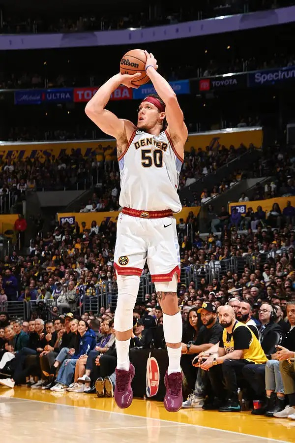

# Threads 貼文 DJ0Aj_IzROY

- 帳號: [@drchenghao](https://www.threads.com/@drchenghao)（程皓醫師｜好動人生。 運動與家庭醫學，已認證）
- 貼文 URL: https://www.threads.com/@drchenghao/post/DJ0Aj_IzROY
- 發文時間: 2025-05-19T07:02:40+08:00（UTC+8，時間戳 1747609360）
- 類型: photo
- 愛心數: 1724
- 回覆數: 32
- 轉發數: 23
- 引用數: 1
- 備註: 貼文曾被編輯

## 貼文文字

❗Gordon 超越醫學的拼勁❗
Gordon 帶傷上陣打G7，說實話，只有驚訝與不捨，雖然最後 93：125不幸落敗，但他的精神已經烙印在我們心中

為什麼2級腿後肌傷勢不建議打？
1. 運動表現影響非常大，衝刺速度、跳躍等皆會影響，以球團角度讓一位這種傷勢球員比賽，只能說金塊是真沒人了
2. 傷勢非常可能惡化成3級拉傷，甚至斷裂，儘管休賽季有可能完全恢復，但很少會有球員或球團這種願意冒這種風險，但也只能說，只有在季後賽G7才有可能發生這種事

不管如何， Gordon 你真的太屌了，期待你下季能滿血回歸

## 圖片

- 原始圖片 URL: https://scontent-sin6-3.cdninstagram.com/v/t51.2885-15/499708771_17852807988446758_439674482654170026_n.webp?efg=eyJ2ZW5jb2RlX3RhZyI6InRocmVhZHMuRkVFRC5pbWFnZV91cmxnZW4uNjAwLnNkci5yZWd1bGFyX3Bob3RvLmMyIn0&_nc_ht=scontent-sin6-3.cdninstagram.com&_nc_cat=110&_nc_oc=Q6cZ2gFLCpfbUkA-lRRmY82uikkJLPa-t0CpuSUxqVe5xHyHcOZ0DFiHdbl2wca1ng5OB40oyZa4OYuU7Ru_0ojXpKs9&_nc_ohc=heQnyi_TOxAQ7kNvwH9m7ZW&_nc_gid=uqM5Bsb4ZsDkB6H32RkoLQ&edm=APs17CUBAAAA&ccb=7-5&ig_cache_key=MzYzNTUzMzI3MjE2OTkxMTE5Mg%3D%3D.3-ccb7-5&oh=00_AQI944ZijdDKWOyS2riIMX7ZBB_eF_ddEfzbOYXY4Ou89g&oe=6AA60217&_nc_sid=10d13b
- 尺寸: 600x900
