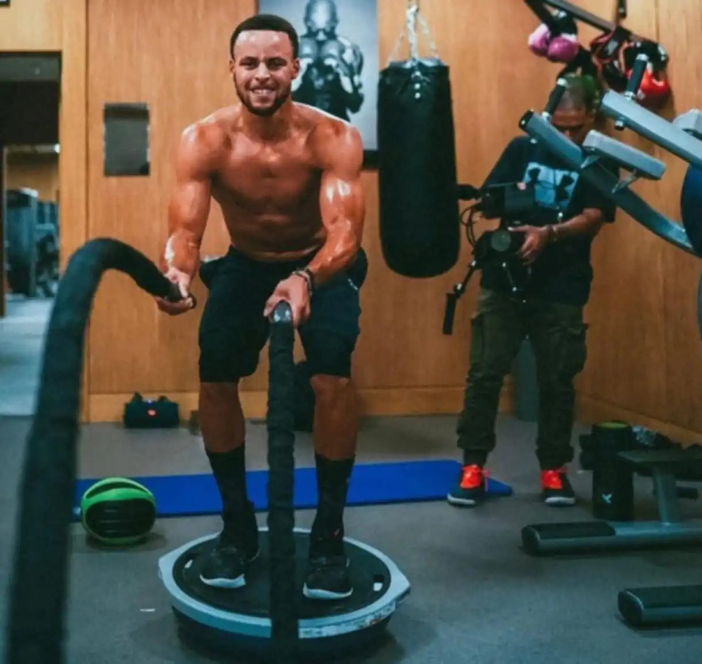

# Threads 貼文 DJ3bheazTvv

- 帳號: [@drchenghao](https://www.threads.com/@drchenghao)（程皓醫師｜好動人生。 運動與家庭醫學，已認證）
- 貼文 URL: https://www.threads.com/@drchenghao/post/DJ3bheazTvv
- 發文時間: 2025-05-20T14:55:58+08:00（UTC+8，時間戳 1747724158）
- 類型: photo
- 愛心數: 266
- 回覆數: 3
- 轉發數: 1
- 引用數: 0

## 貼文文字

最近看到許多球員受傷，也有些感觸

許多熱愛運動的朋友，在受傷後總是著急的想回到賽場，卻只依賴「被動治療」：熱敷、電療、按摩，然後，等待奇蹟。

但你知道嗎？
傷口的癒合，從來不只是時間的問題，而是你「如何主動參與」自己的復原旅程。

NBA球員在受傷後所做的努力是無止盡的訓練，而我們更該如此，主動的治療、主動的訓練，積極參與這個過程，你能更快好起來！

追蹤我關注運動傷害，之後分享Curry訓練🔥

## 圖片

- 原始圖片 URL: https://scontent-sin6-3.cdninstagram.com/v/t51.2885-15/499555711_17852970888446758_699309255750618576_n.webp?efg=eyJ2ZW5jb2RlX3RhZyI6InRocmVhZHMuRkVFRC5pbWFnZV91cmxnZW4uMTIyMC5zZHIucmVndWxhcl9waG90by5jMiJ9&_nc_ht=scontent-sin6-3.cdninstagram.com&_nc_cat=110&_nc_oc=Q6cZ2gFLCpfbUkA-lRRmY82uikkJLPa-t0CpuSUxqVe5xHyHcOZ0DFiHdbl2wca1ng5OB40oyZa4OYuU7Ru_0ojXpKs9&_nc_ohc=U_SaLko_IYwQ7kNvwGXW-s5&_nc_gid=uqM5Bsb4ZsDkB6H32RkoLQ&edm=APs17CUBAAAA&ccb=7-5&ig_cache_key=MzYzNjQ5NjI3MTc4NTQwOTUxOQ%3D%3D.3-ccb7-5&oh=00_AQLGrSvN1mBH1ZHobi0qU4njHpW7o11nXOdl93lgIB29WA&oe=6AA5FC06&_nc_sid=10d13b
- 尺寸: 1220x1155
