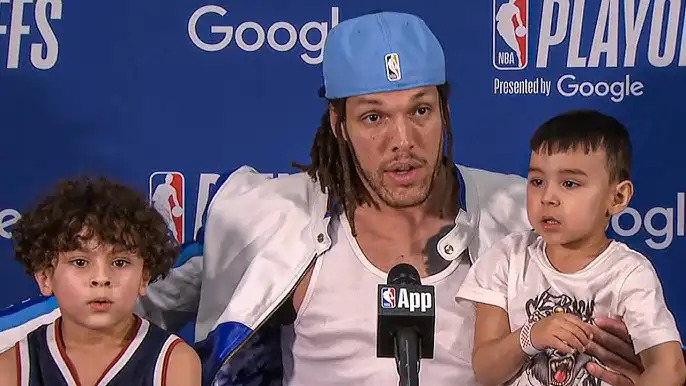

# Threads 貼文 DJ7ziaHTWdJ

- 帳號: [@drchenghao](https://www.threads.com/@drchenghao)（程皓醫師｜好動人生。 運動與家庭醫學，已認證）
- 貼文 URL: https://www.threads.com/@drchenghao/post/DJ7ziaHTWdJ
- 發文時間: 2025-05-22T07:42:47+08:00（UTC+8，時間戳 1747870967）
- 類型: photo
- 愛心數: 46
- 回覆數: 5
- 轉發數: 0
- 引用數: 0
- 備註: 貼文曾被編輯

## 貼文文字

❗補上Gordon G7賽後訪談，談傷後快速緩解及返場❗

對運動員而言，不管中西醫，任何能舒緩症狀的都可以嘗試，非禁藥即可

以 Gordon 提到的 冷熱交替療法及高壓氧為例，這兩者雖然在研究上效果並無定論，但對於運動員主觀感受是有幫助的，包括腫脹感、痠痛感等，也才會花他們珍貴的時間去做

同樣的，作為運動醫學科，只要對患者有幫助的方式，我們都會使用，從針灸到注射、高壓氧、震波、訓練、徒手
只要能夠好，能讓你打球，就全部用上吧🔥

關注我，下次來談談NBA常用的高壓氧治療

----------以下為節錄翻譯------------
記者：你什麼時候知道自己會上場？復健過程是怎樣的？
Gordon：我其實蠻確定自己會上場的。
這段時間就是專注在恢復。
大概花了 36 到 48 小時的時間進行各種恢復療程，能做的我都做了。
冷熱交替療法、按摩、高壓氧艙，所有我能做的都做了。
就只是為了能上場，為了隊友拼搏。

記者：當你看到 MRI 結果時，你對傷勢可能惡化這件事有多擔心？

Gordon：我當然知道風險。
不幸的是，傷病就是比賽的一部分。
我知道那個風險，我還是想為隊友出戰。

## 圖片

- 原始圖片 URL: https://scontent-sin6-3.cdninstagram.com/v/t51.2885-15/500035119_17853192042446758_7823302648227457043_n.webp?efg=eyJ2ZW5jb2RlX3RhZyI6InRocmVhZHMuRkVFRC5pbWFnZV91cmxnZW4uNjg2LnNkci5yZWd1bGFyX3Bob3RvLmMyIn0&_nc_ht=scontent-sin6-3.cdninstagram.com&_nc_cat=110&_nc_oc=Q6cZ2gFLCpfbUkA-lRRmY82uikkJLPa-t0CpuSUxqVe5xHyHcOZ0DFiHdbl2wca1ng5OB40oyZa4OYuU7Ru_0ojXpKs9&_nc_ohc=xE5UpkSNYgYQ7kNvwEB_DXU&_nc_gid=uqM5Bsb4ZsDkB6H32RkoLQ&edm=APs17CUBAAAA&ccb=7-5&ig_cache_key=MzYzNzcyNzc4ODkwNTg4MzQ2NQ%3D%3D.3-ccb7-5&oh=00_AQK8EGCb8YGMUksK_9sHGvRc5DTpzXxPID5Dz2EJ7rKG1A&oe=6AA5EA02&_nc_sid=10d13b
- 尺寸: 686x386
