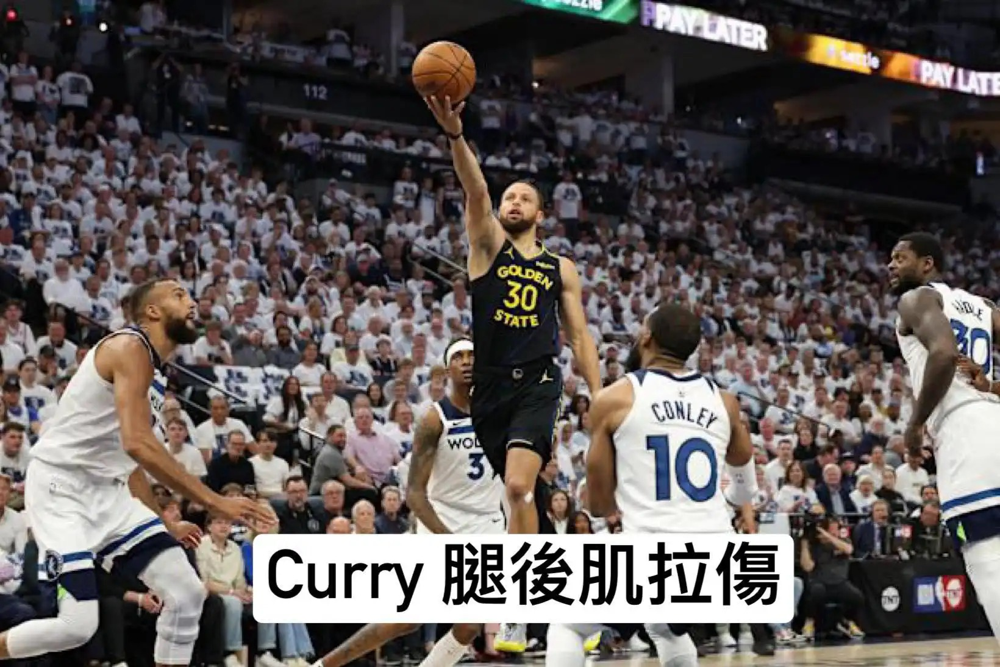

# Threads 貼文 DJVzmv4z9Rg

- 帳號: [@drchenghao](https://www.threads.com/@drchenghao)（程皓醫師｜好動人生。 運動與家庭醫學，已認證）
- 貼文 URL: https://www.threads.com/@drchenghao/post/DJVzmv4z9Rg
- 發文時間: 2025-05-07T13:32:14+08:00（UTC+8，時間戳 1746595934）
- 類型: photo
- 愛心數: 276
- 回覆數: 12
- 轉發數: 10
- 引用數: 10

## 貼文文字

🏀 雖然今天贏了，但 Stephen Curry竟然腿後肌拉傷，何時能回場，讓我們一起看，勇士球迷一起來集氣吧！

❗傷情回顧：
在今日對陣灰狼的季後賽中，Curry因回防時變向導致左腿後肌拉傷。
⚠️ 典型損傷機制：髖部急速屈曲 + 膝部伸展（常見於籃球急停跳投與防守橫移動作）

❗懶人包：
▶️輕微拉傷、撕裂傷，理想建議2週以上，但球員與球團協調後可能提前，但再傷率非常高
▶️嚴重撕裂傷，缺席剩餘季後賽
---

🔍 腿後肌拉傷3階段處理，視情況過程可加速

1️⃣ 急性期（0-24小時）
立刻執行 R.I.C.E原則（休息/冰敷/加壓/抬高）
超音波及MRI 檢查確認傷害嚴重程度
其他輔助治療：肌貼處理、針灸、高壓氧等等，可個人化調整
2️⃣ 復健訓練期
漸進式離心肌力訓練（北歐腿後肌訓練等）
動態神經肌肉控制訓練（平衡墊單腿硬舉）
3️⃣ 回歸賽場測試
需通過單腳腿後橋式>30次、單腳跳躍、連續跳躍等測試
高強度變向衝刺訓練無不適(模擬賽場情況）
---

⏳ 回歸時間預測
以下為常用準則，但對於運動員通常無法完全套用

## 圖片

- 原始圖片 URL: https://scontent-sin6-3.cdninstagram.com/v/t51.2885-15/495905396_17851284819446758_8836826717180832442_n.webp?efg=eyJ2ZW5jb2RlX3RhZyI6InRocmVhZHMuRkVFRC5pbWFnZV91cmxnZW4uMTY0MC5zZHIucmVndWxhcl9waG90by5jMiJ9&_nc_ht=scontent-sin6-3.cdninstagram.com&_nc_cat=110&_nc_oc=Q6cZ2gFXsh8mXZ93QTS4l9nTEe4kD1MV830LIDbrdOHpd5dvW7jy6hRqIJwGEmWZwaj-sr-vQjf_CIcAytLCSA9jsMeH&_nc_ohc=uH-ta61BtYIQ7kNvwGKVrt3&_nc_gid=Tk1510hAsDQmt5thJNTfXA&edm=APs17CUBAAAA&ccb=7-5&ig_cache_key=MzYyNzAzMjAzODA0Nzk5NDk3Ng%3D%3D.3-ccb7-5&oh=00_AQIApHfDDxaXTP7w6SSqqXIam5SzmrsYmrTlQI28_I8M0w&oe=6AA5ED7D&_nc_sid=10d13b
- 尺寸: 1640x1095
