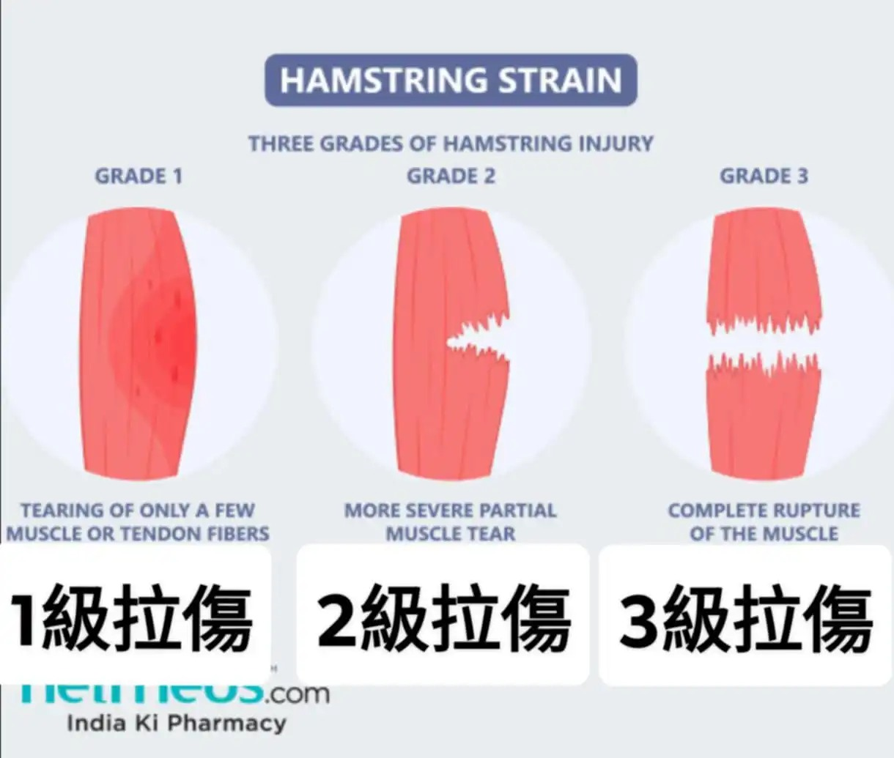

# Threads 貼文 DJXjoW2z18i

- 帳號: [@drchenghao](https://www.threads.com/@drchenghao)（程皓醫師｜好動人生。 運動與家庭醫學，已認證）
- 貼文 URL: https://www.threads.com/@drchenghao/post/DJXjoW2z18i
- 發文時間: 2025-05-08T05:51:07+08:00（UTC+8，時間戳 1746654667）
- 類型: photo
- 愛心數: 4096
- 回覆數: 62
- 轉發數: 54
- 引用數: 4

## 貼文文字

❗Curry 傷勢更新 台灣時間，5/8 AM5:00❗
Golden State's #StephenCurry has sustained a Grade 1 left hamstring strain.
Curry 此次為1級腿後肌拉傷，這大概是最好的消息了！😀

1級拉傷代表輕微拉傷，且MRI影像上沒有異狀，大家可以放心啦！！

預計休一至兩週，很大概率取決於賽事進展，如果我勇快樂夥伴們能夠繼續維持好表現，大概率能夠休到第四戰或是直接晉級（？，接下來就靜待我們的老大回歸，能多休一場是一場吧！

❗附上圖讓大家了解這消息有多讓人開心🎉

## 圖片

- 原始圖片 URL: https://scontent-sin6-3.cdninstagram.com/v/t51.2885-15/496213091_17851375704446758_5066640352086027491_n.webp?efg=eyJ2ZW5jb2RlX3RhZyI6InRocmVhZHMuRkVFRC5pbWFnZV91cmxnZW4uMTIyMC5zZHIucmVndWxhcl9waG90by5jMiJ9&_nc_ht=scontent-sin6-3.cdninstagram.com&_nc_cat=110&_nc_oc=Q6cZ2gFXsh8mXZ93QTS4l9nTEe4kD1MV830LIDbrdOHpd5dvW7jy6hRqIJwGEmWZwaj-sr-vQjf_CIcAytLCSA9jsMeH&_nc_ohc=lBw7HQ5-SqkQ7kNvwE9ETi0&_nc_gid=Tk1510hAsDQmt5thJNTfXA&edm=APs17CUBAAAA&ccb=7-5&ig_cache_key=MzYyNzUyNDcyOTgxOTA2MjA1MA%3D%3D.3-ccb7-5&oh=00_AQICF9aFiDV55L_bgQhl0CneScmactzSPUJjIxD76Rfc3Q&oe=6AA6010A&_nc_sid=10d13b
- 尺寸: 1220x1035
