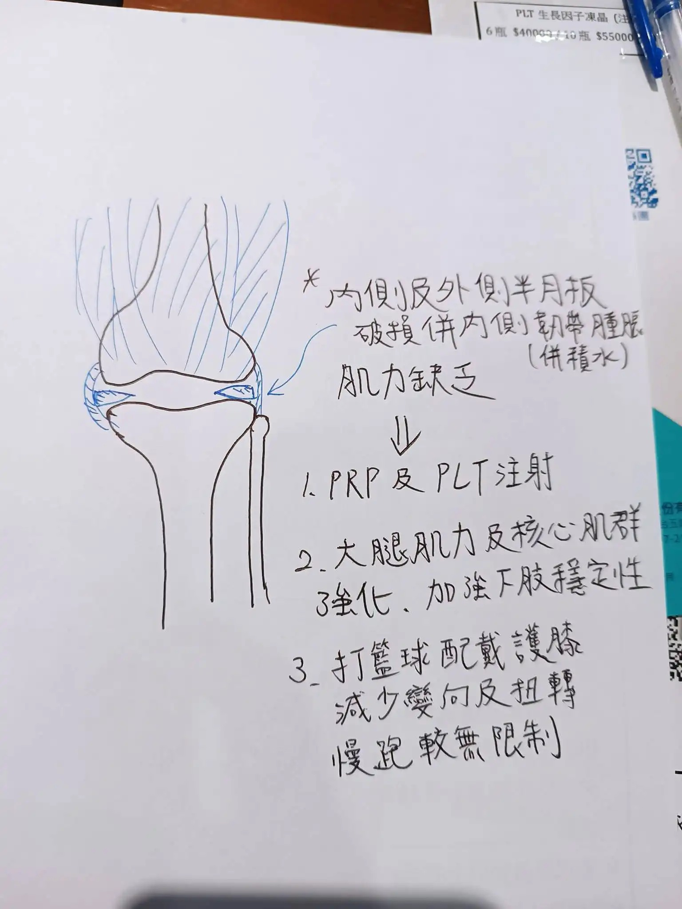

# Threads 貼文 DJ_jM8WT4qi

- 帳號: [@drchenghao](https://www.threads.com/@drchenghao)（程皓醫師｜好動人生。 運動與家庭醫學，已認證）
- 貼文 URL: https://www.threads.com/@drchenghao/post/DJ_jM8WT4qi
- 發文時間: 2025-05-23T18:37:00+08:00（UTC+8，時間戳 1747996620）
- 類型: photo
- 愛心數: 60
- 回覆數: 0
- 轉發數: 4
- 引用數: 0

## 貼文文字

【運動醫學診間隨筆手繪】
時常有熱愛籃球的患者因膝蓋疼痛來到我的診間，對我們來說，不只是治療關節，更是幫助他重返球場的任務。

完整的膝關節治療需要兩大關鍵：
軟組織修復：透過超音波導引注射精準治療
運動訓練：強化下肢穩定性與核心肌力
（沒有肌肉支撐，再強的關節也難以負荷）

我們最重視的是你的目標
「醫生，我只是想假日投投籃，有機會嗎」
當然，這就是我們全力協助的方向。

門診手繪圖於附圖，圖為半月板及韌帶受傷患者之治療計畫，追蹤我超越運動傷害👍

## 圖片

- 原始圖片 URL: https://scontent-sin6-3.cdninstagram.com/v/t51.2885-15/500787731_17853364362446758_6345398519929101798_n.webp?efg=eyJ2ZW5jb2RlX3RhZyI6InRocmVhZHMuRkVFRC5pbWFnZV91cmxnZW4uMTUzNi5zZHIucmVndWxhcl9waG90by5jMiJ9&_nc_ht=scontent-sin6-3.cdninstagram.com&_nc_cat=110&_nc_oc=Q6cZ2gFLCpfbUkA-lRRmY82uikkJLPa-t0CpuSUxqVe5xHyHcOZ0DFiHdbl2wca1ng5OB40oyZa4OYuU7Ru_0ojXpKs9&_nc_ohc=4vZlF8L0aMIQ7kNvwHx2XdC&_nc_gid=uqM5Bsb4ZsDkB6H32RkoLQ&edm=APs17CUBAAAA&ccb=7-5&ig_cache_key=MzYzODc4MTg0NDk5OTA4MDYxMA%3D%3D.3-ccb7-5&oh=00_AQKQBg4dQn3wmTwuLSXk30oNjq0J4xo5DvtOpKfxZrh11g&oe=6AA5DA99&_nc_sid=10d13b
- 尺寸: 1536x2048
