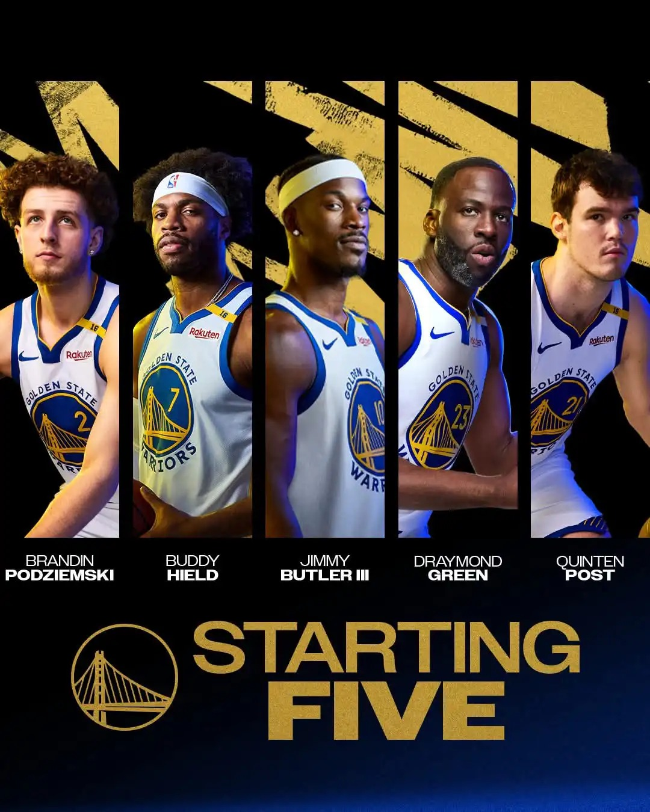

# Threads 貼文 DJaZSBGTBQI

- 帳號: [@drchenghao](https://www.threads.com/@drchenghao)（程皓醫師｜好動人生。 運動與家庭醫學，已認證）
- 貼文 URL: https://www.threads.com/@drchenghao/post/DJaZSBGTBQI
- 發文時間: 2025-05-09T08:18:25+08:00（UTC+8，時間戳 1746749905）
- 類型: photo
- 愛心數: 72
- 回覆數: 1
- 轉發數: 0
- 引用數: 0

## 貼文文字

無咖日的第一戰，5/9 8：30
Curry 隨隊參加比賽，並未先返回舊金山復健訓練，讓我們來看看Kerr 又能從這群快樂夥伴中變出什麼魔法😆

我是程皓醫師，追蹤關注我 follow Curry 及勇士近況🎉

## 圖片

- 原始圖片 URL: https://scontent-sin6-3.cdninstagram.com/v/t51.2885-15/496213791_17851510977446758_4005679568621110699_n.webp?efg=eyJ2ZW5jb2RlX3RhZyI6InRocmVhZHMuRkVFRC5pbWFnZV91cmxnZW4uMTA4MC5zZHIucmVndWxhcl9waG90by5jMiJ9&_nc_ht=scontent-sin6-3.cdninstagram.com&_nc_cat=110&_nc_oc=Q6cZ2gFXsh8mXZ93QTS4l9nTEe4kD1MV830LIDbrdOHpd5dvW7jy6hRqIJwGEmWZwaj-sr-vQjf_CIcAytLCSA9jsMeH&_nc_ohc=iBKy60FfAiAQ7kNvwGFIo4W&_nc_gid=Tk1510hAsDQmt5thJNTfXA&edm=APs17CUBAAAA&ccb=7-5&ig_cache_key=MzYyODMyMzYzOTA5MzEwNTY3Mg%3D%3D.3-ccb7-5&oh=00_AQLeHZqRyJ5XSwuo6PqsI6v854BKsSXYj_WoJgqPsSiyuw&oe=6AA5DDFF&_nc_sid=10d13b
- 尺寸: 1080x1350
