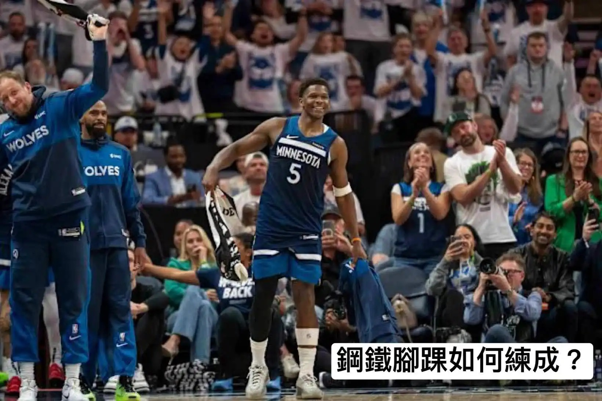
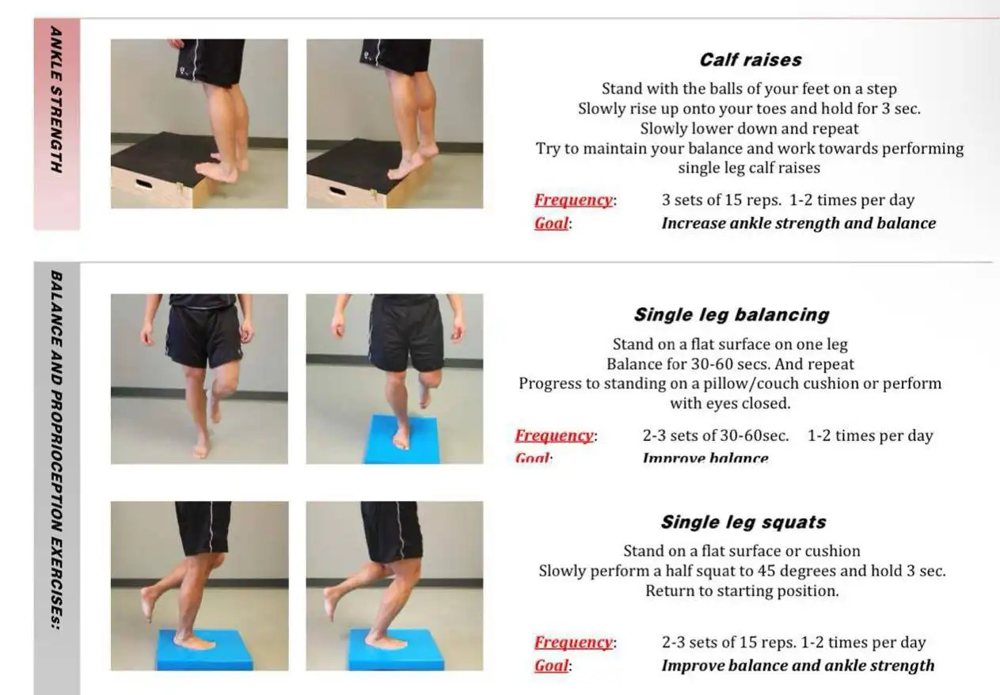

# Threads 貼文 DJdw2txT04T

- 帳號: [@drchenghao](https://www.threads.com/@drchenghao)（程皓醫師｜好動人生。 運動與家庭醫學，已認證）
- 貼文 URL: https://www.threads.com/@drchenghao/post/DJdw2txT04T
- 發文時間: 2025-05-10T15:42:07+08:00（UTC+8，時間戳 1746862927）
- 類型: carousel
- 愛心數: 58
- 回覆數: 1
- 轉發數: 0
- 引用數: 0
- 備註: 貼文曾被編輯

## 貼文文字

❗勇士強敵，G2 受傷後馬上再戰，來看看Anthony Edwards的鋼鐵腳踝是如何練成的❗

G2灰狼對勇士的比賽中，Anthony Edwards在第二節一次切入時腳踝扭傷又意外被TJD不慎踩到，當場痛苦倒地，但下半場竟然直接強勢回歸砍下20分，到底他是怎麼鍛鍊的?

腳踝扭傷是很多籃球員的惡夢，像是以前的Curry就反覆扭傷過，甚至一度要退出NBA。

預防腳踝扭傷最重要的就是「腳踝穩定性訓練」，透過加強踝關節週邊肌力及神經控制能力，能夠在極限運動狀態下依然維持穩定，保護腳踝！
(動作見留言）

我是程皓醫師，追蹤關注我 follow Curry及勇士對手近況🎉

## 圖片

- 原始圖片 URL: https://scontent-sin6-3.cdninstagram.com/v/t51.2885-15/496622531_17851676490446758_8628734459523734157_n.webp?efg=eyJ2ZW5jb2RlX3RhZyI6InRocmVhZHMuQ0FST1VTRUxfSVRFTS5pbWFnZV91cmxnZW4uMTY0MC5zZHIucmVndWxhcl9waG90by5jMiJ9&_nc_ht=scontent-sin6-3.cdninstagram.com&_nc_cat=110&_nc_oc=Q6cZ2gEOTBAv-E7E7JZi1djoKo-KQKPo5v0gvQnK2Y82zsBqe1SAiaZerTA7aUajokXQprmLV0feLaHY_yHuUJS1ZwZe&_nc_ohc=NeS4_zbvhrIQ7kNvwHpbYOP&_nc_gid=14H4JB2WtHHw0LdGCS5pMQ&edm=APs17CUBAAAA&ccb=7-5&ig_cache_key=MzYyOTI3MTczNTM4MTgyMjYzOA%3D%3D.3-ccb7-5&oh=00_AQJy4ittUERgcL8oduxUDgApF8NagyzGNCffWBenBSmr0A&oe=6AA5ED82&_nc_sid=10d13b
- 尺寸: 1640x1095

- 原始圖片 URL: https://scontent-sin6-3.cdninstagram.com/v/t51.2885-15/496641163_17851676481446758_1322181627426250517_n.webp?efg=eyJ2ZW5jb2RlX3RhZyI6InRocmVhZHMuQ0FST1VTRUxfSVRFTS5pbWFnZV91cmxnZW4uMTI2My5zZHIucmVndWxhcl9waG90by5jMiJ9&_nc_ht=scontent-sin6-3.cdninstagram.com&_nc_cat=110&_nc_oc=Q6cZ2gEOTBAv-E7E7JZi1djoKo-KQKPo5v0gvQnK2Y82zsBqe1SAiaZerTA7aUajokXQprmLV0feLaHY_yHuUJS1ZwZe&_nc_ohc=vtu4B7y2k-MQ7kNvwFrIRTx&_nc_gid=14H4JB2WtHHw0LdGCS5pMQ&edm=APs17CUBAAAA&ccb=7-5&ig_cache_key=MzYyOTI3MTczNTM4MTk1Mzg1NQ%3D%3D.3-ccb7-5&oh=00_AQKpBJLXGT1AxRJA4CaVF5cTQX3EQ39g8fAfoy5FoXezDA&oe=6AA5DA6B&_nc_sid=10d13b
- 尺寸: 1263x878
