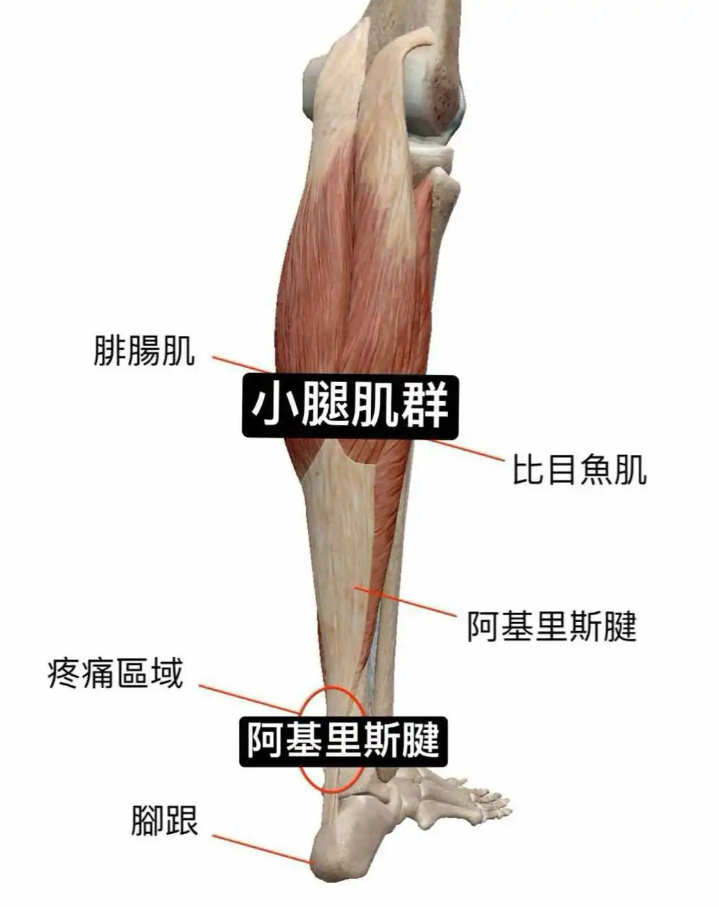

# Threads 貼文 DJgZD4FTTkK

- 帳號: [@drchenghao](https://www.threads.com/@drchenghao)（程皓醫師｜好動人生。 運動與家庭醫學，已認證）
- 貼文 URL: https://www.threads.com/@drchenghao/post/DJgZD4FTTkK
- 發文時間: 2025-05-11T16:11:55+08:00（UTC+8，時間戳 1746951115）
- 類型: photo
- 愛心數: 423
- 回覆數: 17
- 轉發數: 4
- 引用數: 5

## 貼文文字

❗勇狼G3賽後討論，為什麼Curry不該著急上場，從KD曾經的傷勢談Curry的傷❗

2019年季後賽，Kevin Durant的傷病是「過度消耗導致重傷」的血淚教訓，也是勇迷心中永遠的痛：
1️⃣ 西區半決賽小腿拉傷（對火箭G5）：關鍵時刻倒下，顯示長期高強度的負荷。
2️⃣ 總決賽阿基里斯腱斷裂（對暴龍G5)：強行復出+小腿未痊癒，讓跟腱承受致命壓力。
兩者基於解剖位置幾乎有絕對的關聯性（附圖）

疲勞對職業運動員有多可怕，KD那年季後賽受傷前場均上場接近40分鐘，前三年出賽數全聯盟前幾名，連續兩年總冠軍，出賽場數每年至少多16場。

「季後賽是場高強度馬拉松，寧可完美復出，也不應勉強上場導致最糟結果，全力保護核心健康。」

回到Curry的傷勢，你是球團，你還敢讓他上場嗎，留言一起討論!

🏀 我是程皓醫師，追蹤關注我學習運動知識，follow Curry 及勇士近況🎉

## 圖片

- 原始圖片 URL: https://scontent-sin6-3.cdninstagram.com/v/t51.2885-15/496927181_17851823571446758_5644345035614303275_n.webp?efg=eyJ2ZW5jb2RlX3RhZyI6InRocmVhZHMuRkVFRC5pbWFnZV91cmxnZW4uMTA0Ni5zZHIucmVndWxhcl9waG90by5jMiJ9&_nc_ht=scontent-sin6-3.cdninstagram.com&_nc_cat=110&_nc_oc=Q6cZ2gEOTBAv-E7E7JZi1djoKo-KQKPo5v0gvQnK2Y82zsBqe1SAiaZerTA7aUajokXQprmLV0feLaHY_yHuUJS1ZwZe&_nc_ohc=HFdYacyJiHsQ7kNvwHgFDeV&_nc_gid=14H4JB2WtHHw0LdGCS5pMQ&edm=APs17CUBAAAA&ccb=7-5&ig_cache_key=MzYzMDAxMTUxNzIwMDMxNjY4Mg%3D%3D.3-ccb7-5&oh=00_AQIocQXWKuj-w6QVQtgTaqjaqZBkoBRXksUyKM-lv9v2Kw&oe=6AA5E702&_nc_sid=10d13b
- 尺寸: 1046x1318
