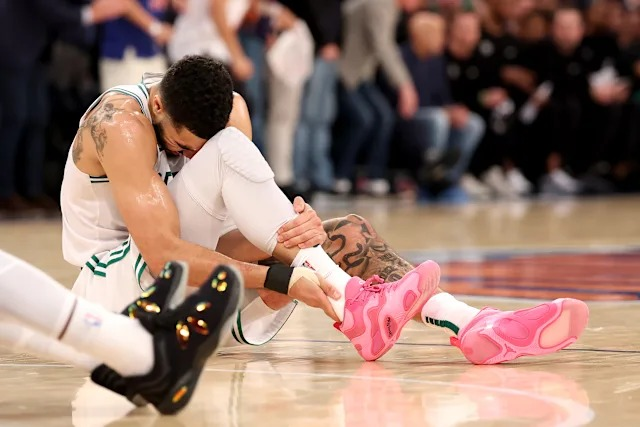

# Threads 貼文 DJlQKU_zvyp

- 帳號: [@drchenghao](https://www.threads.com/@drchenghao)（程皓醫師｜好動人生。 運動與家庭醫學，已認證）
- 貼文 URL: https://www.threads.com/@drchenghao/post/DJlQKU_zvyp
- 發文時間: 2025-05-13T13:30:22+08:00（UTC+8，時間戳 1747114222）
- 類型: photo
- 愛心數: 321
- 回覆數: 19
- 轉發數: 9
- 引用數: 8
- 備註: 貼文曾被編輯

## 貼文文字

❗如果Jason Tatum真的是阿基里斯腱斷裂，他還能回來嗎❗

看完了勇狼，接著要來關心一下Jayson Tatum 的傷勢，剛好之前曾寫過一篇Lillard阿基里斯腱斷裂的文章，讓我們稍微複習一下！

讓我們從NBA歷史數據看他能否重返球場

🏀 懶人包：
27歲的 JT 有超過80%回歸率，爆發力可能受影響，但以他打法，仍大概率維持職業生涯。

🔬 科學數據說話：20 年追蹤結果
25位NBA球員，1996-2016年
1️⃣ 回歸率與時間成本
80% 球員能復出，但平均需 311 天（約 10.5 個月）
35 歲以上球員僅 28% 能恢復傷前水平
回歸後 2 年內退役率高達 65%

2️⃣ 進攻效率雪崩式下滑
VORP（球員替代價值） 下降 24.1% (進攻效率大幅下降）
每百回合得分減少 5-6.3 分
勝利貢獻值（WS） 平均損失 2.6 場

3️⃣ 防守端驚人韌性
防守評分無顯著差異（P=0.72）
抄截/阻攻數據下滑，但失分控制力維持（防守意識＞爆發力）

(追蹤關注我了解更多內容，留言接續)

## 圖片

- 原始圖片 URL: https://scontent-sin6-3.cdninstagram.com/v/t51.2885-15/497683805_17852072055446758_4757007252174301706_n.webp?efg=eyJ2ZW5jb2RlX3RhZyI6InRocmVhZHMuRkVFRC5pbWFnZV91cmxnZW4uNjQwLnNkci5yZWd1bGFyX3Bob3RvLmMyIn0&_nc_ht=scontent-sin6-3.cdninstagram.com&_nc_cat=110&_nc_oc=Q6cZ2gEOTBAv-E7E7JZi1djoKo-KQKPo5v0gvQnK2Y82zsBqe1SAiaZerTA7aUajokXQprmLV0feLaHY_yHuUJS1ZwZe&_nc_ohc=1uTTaRIKKrAQ7kNvwGDd9bD&_nc_gid=14H4JB2WtHHw0LdGCS5pMQ&edm=APs17CUBAAAA&ccb=7-5&ig_cache_key=MzYzMTM3OTc1MzAyODQ4NDI2NQ%3D%3D.3-ccb7-5&oh=00_AQIWHB6TGt137klWzy_eCuBIWs3o9WgPcWo1WRzoNgS3vg&oe=6AA5EC4F&_nc_sid=10d13b
- 尺寸: 640x427
