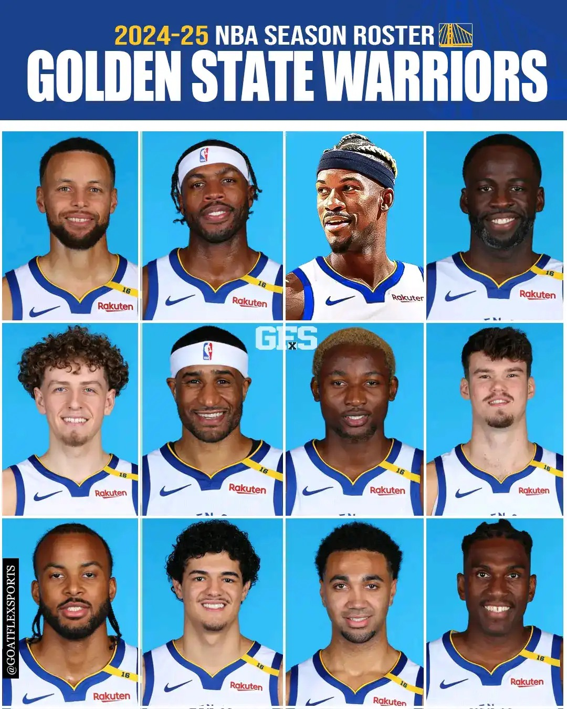

# Threads 貼文 DJoqR3RTxl7

- 帳號: [@drchenghao](https://www.threads.com/@drchenghao)（程皓醫師｜好動人生。 運動與家庭醫學，已認證）
- 貼文 URL: https://www.threads.com/@drchenghao/post/DJoqR3RTxl7
- 發文時間: 2025-05-14T21:16:18+08:00（UTC+8，時間戳 1747228578）
- 類型: photo
- 愛心數: 149
- 回覆數: 8
- 轉發數: 0
- 引用數: 0
- 備註: 貼文曾被編輯

## 貼文文字

🔥勇狼G5 5/15 9：30 準備開打 🔥

目前勇士1：3落後灰狼，老大 Curry 依舊以養傷為重，也避免出現像KD、KT的憾事，等待可能的G6再上場，因此這場只能靠小夥伴們傾盡全力
明年陣容除了幾位重要輪替外，可能都會大換血，所以可能是 Kuminga 最後一場披掛勇士戰袍，且看且珍惜呀，Go Go Warriors❗

今年迎來Butler已經帶給我們很多驚奇了，一起見證這跌宕起伏賽季的最後一程🔥

我是程皓醫師，追蹤我明天一起為勇士集氣🎉

## 圖片

- 原始圖片 URL: https://scontent-sin6-3.cdninstagram.com/v/t51.2885-15/497800675_17852247630446758_2619241076044544274_n.webp?efg=eyJ2ZW5jb2RlX3RhZyI6InRocmVhZHMuRkVFRC5pbWFnZV91cmxnZW4uMTA4MC5zZHIucmVndWxhcl9waG90by5jMiJ9&_nc_ht=scontent-sin6-3.cdninstagram.com&_nc_cat=110&_nc_oc=Q6cZ2gEOTBAv-E7E7JZi1djoKo-KQKPo5v0gvQnK2Y82zsBqe1SAiaZerTA7aUajokXQprmLV0feLaHY_yHuUJS1ZwZe&_nc_ohc=NBIw_iuu7McQ7kNvwFJmOJF&_nc_gid=14H4JB2WtHHw0LdGCS5pMQ&edm=APs17CUBAAAA&ccb=7-5&ig_cache_key=MzYzMjMzOTA0NTAwNTA3Mjc2Mw%3D%3D.3-ccb7-5&oh=00_AQJ3fXtDhWyZvW9Pyf0iIqCXHrqBAooiR7x5VB_H30FCYQ&oe=6AA5DCF1&_nc_sid=10d13b
- 尺寸: 1080x1350
