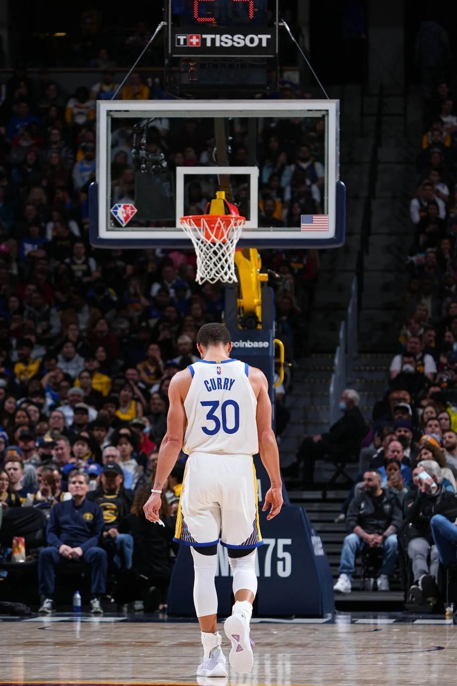

# Threads 貼文 DJqRKgVzZfj

- 帳號: [@drchenghao](https://www.threads.com/@drchenghao)（程皓醫師｜好動人生。 運動與家庭醫學，已認證）
- 貼文 URL: https://www.threads.com/@drchenghao/post/DJqRKgVzZfj
- 發文時間: 2025-05-15T12:15:20+08:00（UTC+8，時間戳 1747282520）
- 類型: photo
- 愛心數: 589
- 回覆數: 15
- 轉發數: 8
- 引用數: 1
- 備註: 貼文曾被編輯

## 貼文文字

至始至終，勇士就是圍繞著Curry的一支球隊，練了一整年，都是以Curry為核心打的合理籃球，在沒有老大的情況下，面對季後賽的硬解局，小球員們各種不敢投，也只能丟給 Butler、Kuminga 硬解，也造就系列賽的結局。

展望休賽季，還能看到 Kuminga 等小將嗎，看到最後這幾場對他的上場處理方式，我相信 Kerr 和團隊們已經想好了，謝謝勇士，期待明年能夠看到更棒的你們🙏

## 圖片

- 原始圖片 URL: https://scontent-sin6-3.cdninstagram.com/v/t51.2885-15/498163238_17852325870446758_1554413898591217745_n.webp?efg=eyJ2ZW5jb2RlX3RhZyI6InRocmVhZHMuRkVFRC5pbWFnZV91cmxnZW4uMTM2NS5zZHIucmVndWxhcl9waG90by5jMiJ9&_nc_ht=scontent-sin6-3.cdninstagram.com&_nc_cat=110&_nc_oc=Q6cZ2gEOTBAv-E7E7JZi1djoKo-KQKPo5v0gvQnK2Y82zsBqe1SAiaZerTA7aUajokXQprmLV0feLaHY_yHuUJS1ZwZe&_nc_ohc=xEjg4zUMlA0Q7kNvwEiXy6g&_nc_gid=14H4JB2WtHHw0LdGCS5pMQ&edm=APs17CUBAAAA&ccb=7-5&ig_cache_key=MzYzMjc5MTUzODEzODcxNjEzMQ%3D%3D.3-ccb7-5&oh=00_AQKH9TAgdHBjlXaUaA19mZrAcutJJiu8agcSPyGBuPnIAg&oe=6AA5FC69&_nc_sid=10d13b
- 尺寸: 1365x2048
