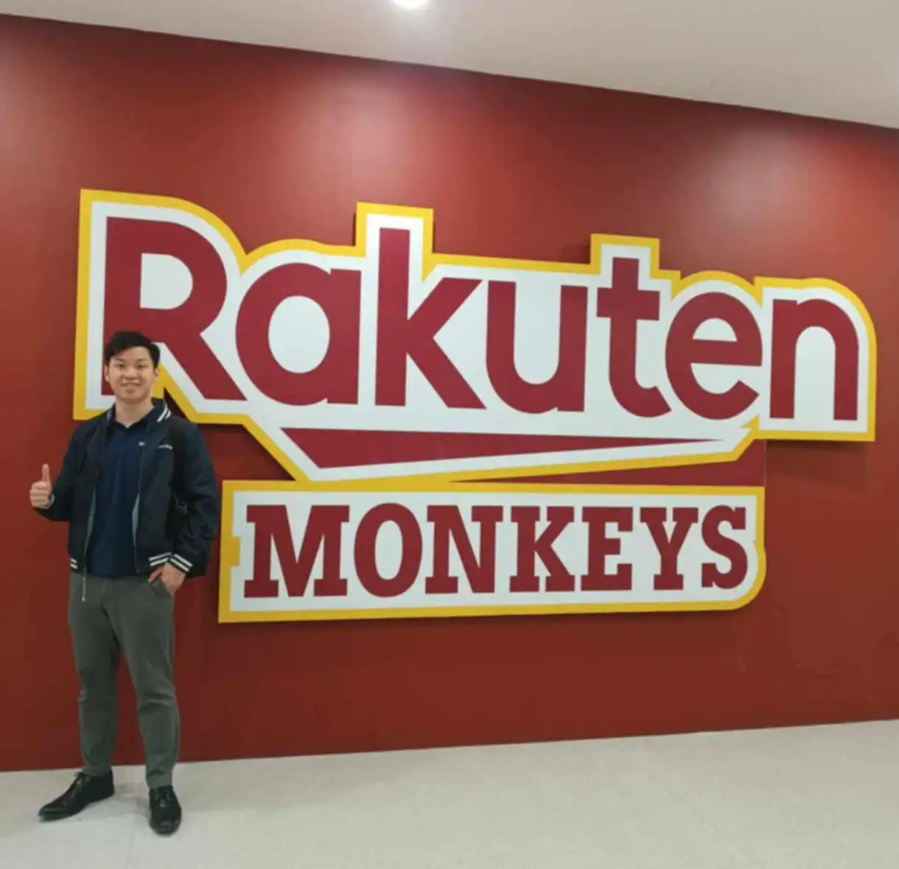

# Threads 貼文 DJqVSOiztLz

- 帳號: [@drchenghao](https://www.threads.com/@drchenghao)（程皓醫師｜好動人生。 運動與家庭醫學，已認證）
- 貼文 URL: https://www.threads.com/@drchenghao/post/DJqVSOiztLz
- 發文時間: 2025-05-15T12:51:20+08:00（UTC+8，時間戳 1747284680）
- 類型: photo
- 愛心數: 662
- 回覆數: 45
- 轉發數: 6
- 引用數: 0
- 備註: 貼文曾被編輯；置頂貼文

## 貼文文字

隨著勇士被淘汰，我的Threads奇幻之旅也先劃上一個逗號，因為各位對於勇士和Curry的支持，讓我更有動力分享資訊給各位，也趁這個機會讓大家了解我平時的業務🙏

【我是誰】
現任聯新國際醫院 運動醫學科醫師，也擔任樂天桃猿棒球隊駐診醫師，專長於運動傷害處理、骨骼肌肉系統疾病、退化性關節問題之診治與功能重建。

同時為業餘籃球愛好者，長年關注各種運動賽事，擔任資深勇迷超過十年，每年的陣容都如數家珍。

【運動醫學在做什麼】
協助運動員和喜好運動、需要活動的人快速回到原本職業和生活，甚至超越過往表現，因此，我們幾乎不會對病人說，你不能再打球/跑步了，快去休息，只要你想，我們會全力協助你🔥

【哪裡可以找到我】
聯新國際醫院
板新醫院
台北聯新國際診所

可以追蹤FB粉絲專頁會放上門診資訊唷，歡迎有運動相關疑問或運動傷害的朋友來諮詢
後續傷勢消息我也會繼續追蹤，請各位朋友繼續支持唷，謝謝🎉

## 圖片

- 原始圖片 URL: https://scontent-sin6-3.cdninstagram.com/v/t51.2885-15/497854746_17852329197446758_590171984260619961_n.webp?efg=eyJ2ZW5jb2RlX3RhZyI6InRocmVhZHMuRkVFRC5pbWFnZV91cmxnZW4uMTIyMC5zZHIucmVndWxhcl9waG90by5jMiJ9&_nc_ht=scontent-sin6-3.cdninstagram.com&_nc_cat=110&_nc_oc=Q6cZ2gFfSoPOiAPWRkDTyJcTAGx0gsc3DRIQbFSb6L67xaVZD1hcTFRv2EKSMNWvP-Rd2p5OYAk_I8cITf9aRsGNCuWk&_nc_ohc=OAGcEPBP7SwQ7kNvwGqJZv5&_nc_gid=qAbpG5jwuCoYPd8cW1UFKg&edm=APs17CUBAAAA&ccb=7-5&ig_cache_key=MzYzMjgwOTY2MDk3MTQwNjA2Nw%3D%3D.3-ccb7-5&oh=00_AQJIVj17m70jThNjiMXkfcxPGtqBdqUQCyf19jx1uXsv7w&oe=6AA5E22B&_nc_sid=10d13b
- 尺寸: 1220x1180
