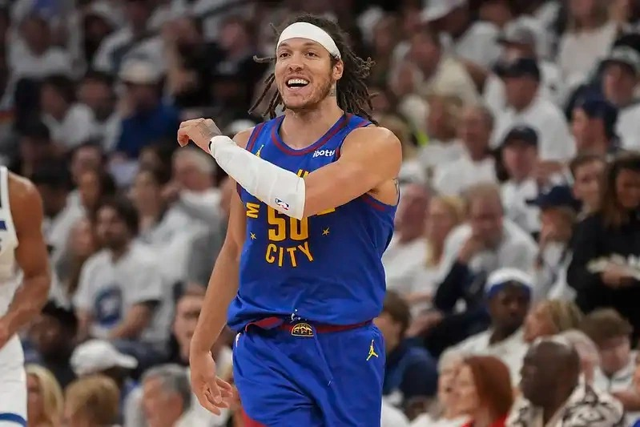

# Threads 貼文 DJsvexRzTL4

- 帳號: [@drchenghao](https://www.threads.com/@drchenghao)（程皓醫師｜好動人生。 運動與家庭醫學，已認證）
- 貼文 URL: https://www.threads.com/@drchenghao/post/DJsvexRzTL4
- 發文時間: 2025-05-16T11:18:43+08:00（UTC+8，時間戳 1747365523）
- 類型: photo
- 愛心數: 142
- 回覆數: 6
- 轉發數: 1
- 引用數: 0

## 貼文文字

金塊雷霆 G6: 系列賽3：3平手

意料之外的勝利，儘管還帶著勇士輸球後的空虛感，還是打起精神來看金塊雷霆比賽，畢竟金塊還充滿著我們這時代情懷的幾位球員，約老師、龜龜、Gordon，想不到本場比賽除了約老師一如既往的發揮外，其他板凳球員也表現的非常好🎉

雷霆我知道你們很強、超強可是我們老人還不想服啊，期待G7來一場奇蹟 😎
還有拜託 Gordon 腿後肌無大礙 🙏

## 圖片

- 原始圖片 URL: https://scontent-sin6-3.cdninstagram.com/v/t51.2885-15/497649507_17852443866446758_7539455799080396753_n.webp?efg=eyJ2ZW5jb2RlX3RhZyI6InRocmVhZHMuRkVFRC5pbWFnZV91cmxnZW4uNzk5LnNkci5yZWd1bGFyX3Bob3RvLmMyIn0&_nc_ht=scontent-sin6-3.cdninstagram.com&_nc_cat=110&_nc_oc=Q6cZ2gFLCpfbUkA-lRRmY82uikkJLPa-t0CpuSUxqVe5xHyHcOZ0DFiHdbl2wca1ng5OB40oyZa4OYuU7Ru_0ojXpKs9&_nc_ohc=DhMJFhDfQOAQ7kNvwGwITQR&_nc_gid=uqM5Bsb4ZsDkB6H32RkoLQ&edm=APs17CUBAAAA&ccb=7-5&ig_cache_key=MzYzMzQ4NzgyMjA2MzQ4MTU5Mg%3D%3D.3-ccb7-5&oh=00_AQJNoCa3xh4dQMGpgqwmxqLtQhKY1dm9u5iNtE0LSKseGw&oe=6AA5E622&_nc_sid=10d13b
- 尺寸: 799x533
