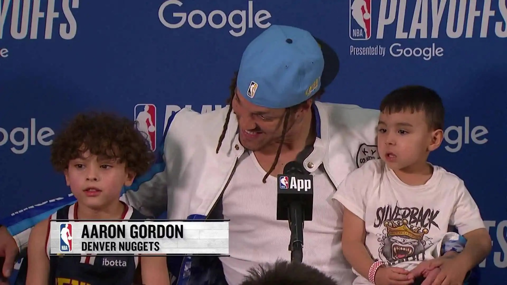

# Threads 貼文 DJvE2gzz4RT

- 帳號: [@drchenghao](https://www.threads.com/@drchenghao)（程皓醫師｜好動人生。 運動與家庭醫學，已認證）
- 貼文 URL: https://www.threads.com/@drchenghao/post/DJvE2gzz4RT
- 發文時間: 2025-05-17T09:03:57+08:00（UTC+8，時間戳 1747443837）
- 類型: photo
- 愛心數: 462
- 回覆數: 27
- 轉發數: 2
- 引用數: 5
- 備註: 貼文曾被編輯

## 貼文文字

❗Gordon竟然也腿後肌拉傷，台灣時間5/17，AM 8:30❗
想不到又有一位重要球員腿後肌拉傷，目前還沒有提到 MRI 報告，大概率也是1級。

腿後肌拉傷最重要幾個風險因子，疲勞、過往大小腿傷勢、膝蓋傷勢、肌張力不平衡。

很明顯高出賽量及比賽高回合數對於這些傷勢影響非常大。

個人非常喜歡Gordon，灌籃大賽失利後，依然默默磨練技術、持續進步，縱使沒能成為王牌，卻能在金塊找到自己的位子，祈禱傷勢輕微。🙏

其他可參考我之前對於Curry的傷勢介紹，放於置頂留言供參考。
-------以下為文章--------
Aaron Gordon第七戰出賽可能成疑，丹佛金塊前鋒 Aaron Gordon 被診斷為左腿腿後肌拉傷，他能否在對上雷霆的第七戰出賽尚未確定。

資訊來源：X

## 圖片

- 原始圖片 URL: https://scontent-sin6-3.cdninstagram.com/v/t51.2885-15/498589314_17852555583446758_3034284959124383434_n.webp?efg=eyJ2ZW5jb2RlX3RhZyI6InRocmVhZHMuRkVFRC5pbWFnZV91cmxnZW4uMTkyMC5zZHIucmVndWxhcl9waG90by5jMiJ9&_nc_ht=scontent-sin6-3.cdninstagram.com&_nc_cat=110&_nc_oc=Q6cZ2gFLCpfbUkA-lRRmY82uikkJLPa-t0CpuSUxqVe5xHyHcOZ0DFiHdbl2wca1ng5OB40oyZa4OYuU7Ru_0ojXpKs9&_nc_ohc=D64NymzB36EQ7kNvwELCdNU&_nc_gid=uqM5Bsb4ZsDkB6H32RkoLQ&edm=APs17CUBAAAA&ccb=7-5&ig_cache_key=MzYzNDE0NDc2MjU3ODA0Mzk4Nw%3D%3D.3-ccb7-5&oh=00_AQLUrwJSNYcJV1usC2IWccxW9nRyOmUc83dDWcXW2IbVpA&oe=6AA5D412&_nc_sid=10d13b
- 尺寸: 1920x1080
