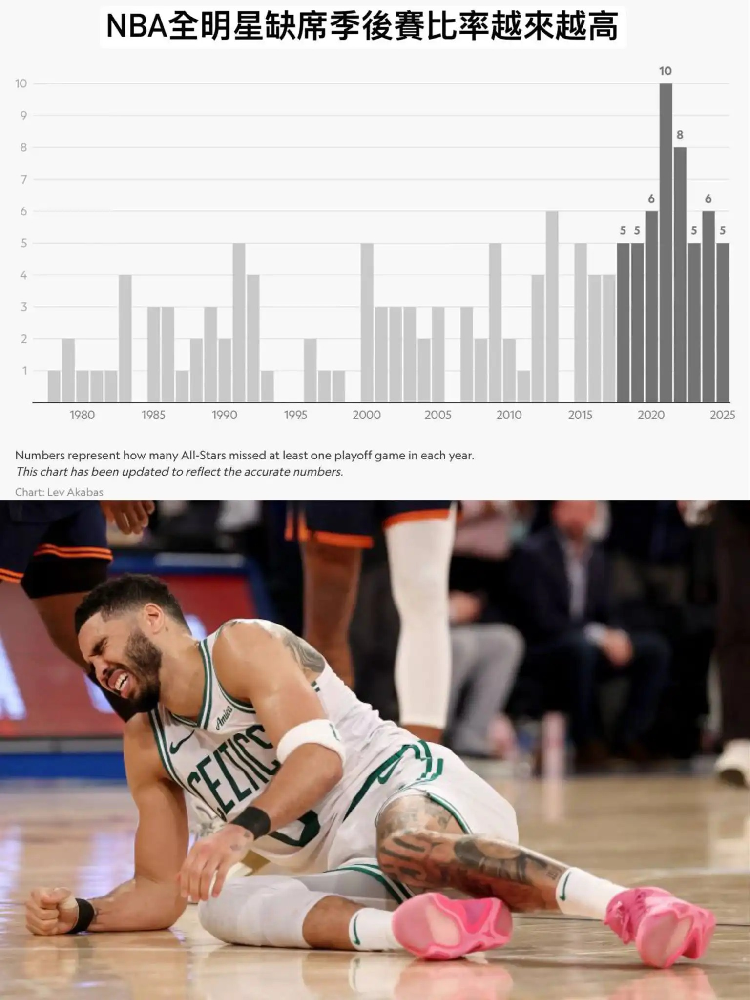

# Threads 貼文 DJxqLtsT01U

- 帳號: [@drchenghao](https://www.threads.com/@drchenghao)（程皓醫師｜好動人生。 運動與家庭醫學，已認證）
- 貼文 URL: https://www.threads.com/@drchenghao/post/DJxqLtsT01U
- 發文時間: 2025-05-18T09:08:38+08:00（UTC+8，時間戳 1747530518）
- 類型: photo
- 愛心數: 89
- 回覆數: 28
- 轉發數: 0
- 引用數: 1
- 備註: 貼文曾被編輯

## 貼文文字

❗️今日休戰，特別報導，看看疲勞對於NBA球星傷病到底影響多大呢❗️

今年季後賽傷病對比賽影響真的太大，舉凡 Curry、Tatum、Gordon、MPJ、Lillard等重要球星都有傷，比的其實根本是誰比較健康，來看看每年數據。

每年如果打到總冠軍賽，最少出賽16場以上，跑動距離增加、攻守回合數又高，尤其前一年在季後賽打到越後面的隊伍，風險越高，且去年還加上奧運影響！ （留言附數據）

以後要看到球星健康打季後賽真的更難了 ，NBA是不是該有些改變呢 🥹

追蹤我了解更多NBA動態與運動傷害 🔥

## 圖片

- 原始圖片 URL: https://scontent-sin6-3.cdninstagram.com/v/t51.2885-15/498203413_17852681238446758_8929262378079071580_n.webp?efg=eyJ2ZW5jb2RlX3RhZyI6InRocmVhZHMuRkVFRC5pbWFnZV91cmxnZW4uMTUzNi5zZHIucmVndWxhcl9waG90by5jMiJ9&_nc_ht=scontent-sin6-3.cdninstagram.com&_nc_cat=110&_nc_oc=Q6cZ2gFLCpfbUkA-lRRmY82uikkJLPa-t0CpuSUxqVe5xHyHcOZ0DFiHdbl2wca1ng5OB40oyZa4OYuU7Ru_0ojXpKs9&_nc_ohc=v_3peSIt1qgQ7kNvwE_mbkC&_nc_gid=uqM5Bsb4ZsDkB6H32RkoLQ&edm=APs17CUBAAAA&ccb=7-5&ig_cache_key=MzYzNDg3MTg5NzE5NDE4ODExNg%3D%3D.3-ccb7-5&oh=00_AQISU-jsbwvXASW26znebF3kTGeTPv_3XvdYTfeUadKC6w&oe=6AA5FEDA&_nc_sid=10d13b
- 尺寸: 1536x2048
