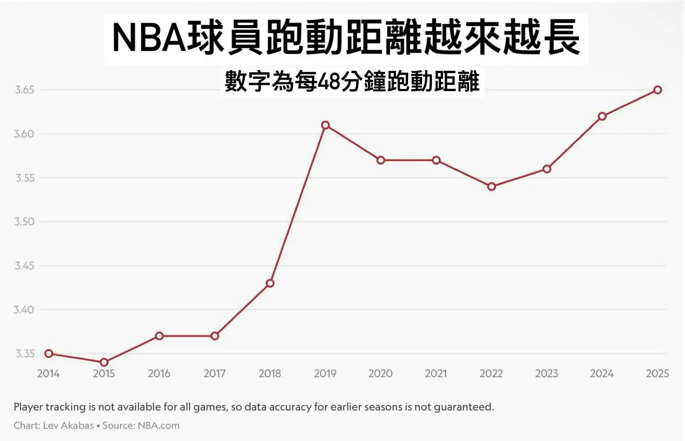

# Threads 貼文 DJxqSl3TORd

- 帳號: [@drchenghao](https://www.threads.com/@drchenghao)（程皓醫師｜好動人生。 運動與家庭醫學，已認證）
- 貼文 URL: https://www.threads.com/@drchenghao/post/DJxqSl3TORd
- 發文時間: 2025-05-18T09:09:34+08:00（UTC+8，時間戳 1747530574）
- 類型: photo
- 愛心數: 13
- 回覆數: 1
- 轉發數: 0
- 引用數: 1
- 備註: 此貼文為作者回覆自己的續文（self-thread），屬於同時發布的貼文群組 [DJxqLtsT01U](https://www.threads.com/@drchenghao/post/DJxqLtsT01U)

## 貼文文字

每年跑動距離增加，攻守回合數增加，更考驗球員的體能

## 圖片

- 原始圖片 URL: https://scontent-sin6-3.cdninstagram.com/v/t51.2885-15/498258304_17852681331446758_6449304744659643724_n.webp?efg=eyJ2ZW5jb2RlX3RhZyI6InRocmVhZHMuRkVFRC5pbWFnZV91cmxnZW4uMTY0MC5zZHIucmVndWxhcl9waG90by5jMiJ9&_nc_ht=scontent-sin6-3.cdninstagram.com&_nc_cat=110&_nc_oc=Q6cZ2gFLCpfbUkA-lRRmY82uikkJLPa-t0CpuSUxqVe5xHyHcOZ0DFiHdbl2wca1ng5OB40oyZa4OYuU7Ru_0ojXpKs9&_nc_ohc=21J_UwYtSsoQ7kNvwEXM6Be&_nc_gid=uqM5Bsb4ZsDkB6H32RkoLQ&edm=APs17CUBAAAA&ccb=7-5&ig_cache_key=MzYzNDg3MjM2OTgyNDk4MjEwOQ%3D%3D.3-ccb7-5&oh=00_AQLwZQiXLRNWP11r09ZvGDqbMZbAwZSLZmKjdK0iztUM0g&oe=6AA5DDC4&_nc_sid=10d13b
- 尺寸: 1640x1057
