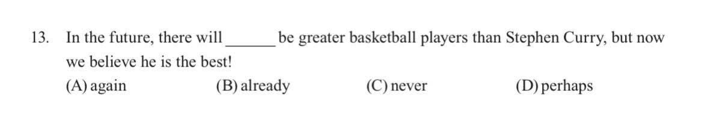

# Threads 貼文 DJystepTMjh

- 帳號: [@drchenghao](https://www.threads.com/@drchenghao)（程皓醫師｜好動人生。 運動與家庭醫學，已認證）
- 貼文 URL: https://www.threads.com/@drchenghao/post/DJystepTMjh
- 發文時間: 2025-05-18T18:49:57+08:00（UTC+8，時間戳 1747565397）
- 類型: photo
- 愛心數: 1738
- 回覆數: 49
- 轉發數: 46
- 引用數: 3
- 備註: 貼文曾被編輯

## 貼文文字

🔥會考有 Curry 🎉
想不到 Curry 竟然會登上本國會考題目，如果讓我寫，我可能會不小心填C
There will never be greater basketball players than Stephen Curry.
很通順呀，沒毛病

## 圖片

- 原始圖片 URL: https://scontent-sin6-3.cdninstagram.com/v/t51.2885-15/498241974_17852731524446758_5288528621315820024_n.jpg?stp=dst-jpg_e35_tt6&efg=eyJ2ZW5jb2RlX3RhZyI6InRocmVhZHMuRkVFRC5pbWFnZV91cmxnZW4uMTE2OC5zZHIucmVndWxhcl9waG90by5jMiJ9&_nc_ht=scontent-sin6-3.cdninstagram.com&_nc_cat=110&_nc_oc=Q6cZ2gFLCpfbUkA-lRRmY82uikkJLPa-t0CpuSUxqVe5xHyHcOZ0DFiHdbl2wca1ng5OB40oyZa4OYuU7Ru_0ojXpKs9&_nc_ohc=W-scr0fYisoQ7kNvwEqzn0x&_nc_gid=uqM5Bsb4ZsDkB6H32RkoLQ&edm=APs17CUBAAAA&ccb=7-5&ig_cache_key=MzYzNTE2NDQ4ODU2OTUwNjAxNw%3D%3D.3-ccb7-5&oh=00_AQJs89ILjbfpeqCP_A4TzJoOsjzRJdaotaIXcxmeSt4M5g&oe=6AA60017&_nc_sid=10d13b
- 尺寸: 1168x202
