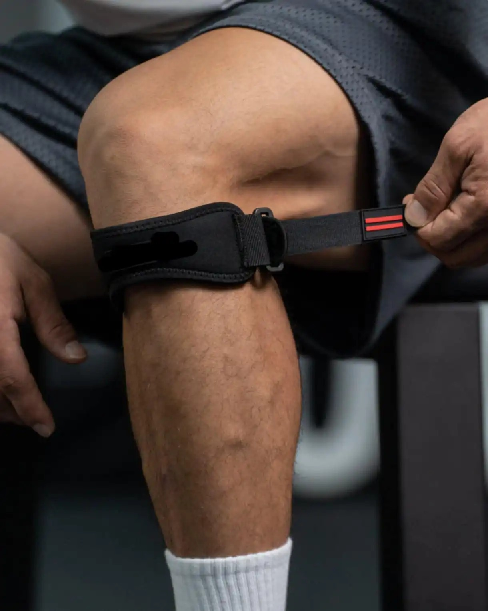

# Threads 貼文 DKCPWHhzSEv

- 帳號: [@drchenghao](https://www.threads.com/@drchenghao)（程皓醫師｜好動人生。 運動與家庭醫學，已認證）
- 貼文 URL: https://www.threads.com/@drchenghao/post/DKCPWHhzSEv
- 發文時間: 2025-05-24T19:41:13+08:00（UTC+8，時間戳 1748086873）
- 類型: photo
- 愛心數: 37
- 回覆數: 2
- 轉發數: 1
- 引用數: 0
- 備註: 貼文曾被編輯

## 貼文文字

籃球護具推薦，髕骨帶🔥

今天看診時又有幾位籃球愛好者問我護具使用，打籃球、跑步膝蓋前方疼痛，我一律推薦使用，髕骨帶

膝前方疼痛，最常見原因為髕腱炎，髕骨帶能夠給予髕骨支撐，減少過度滑動，減輕疼痛

另一方面，因為較其他護具透氣，戴起來也較為舒服，攜帶及清洗也更為簡單

當然，股四頭肌練強才是根本預防方式唷！

留言處經驗分享，歡迎朋友們討論、提問❗

## 圖片

- 原始圖片 URL: https://scontent-sin6-3.cdninstagram.com/v/t51.2885-15/500213233_17853508752446758_5728533341521793064_n.webp?efg=eyJ2ZW5jb2RlX3RhZyI6InRocmVhZHMuRkVFRC5pbWFnZV91cmxnZW4uMTIyMC5zZHIucmVndWxhcl9waG90by5jMiJ9&_nc_ht=scontent-sin6-3.cdninstagram.com&_nc_cat=110&_nc_oc=Q6cZ2gFLCpfbUkA-lRRmY82uikkJLPa-t0CpuSUxqVe5xHyHcOZ0DFiHdbl2wca1ng5OB40oyZa4OYuU7Ru_0ojXpKs9&_nc_ohc=QOsKPLdTAHwQ7kNvwFrpTu1&_nc_gid=uqM5Bsb4ZsDkB6H32RkoLQ&edm=APs17CUBAAAA&ccb=7-5&ig_cache_key=MzYzOTUzODkzOTQ3ODIyMTEwMw%3D%3D.3-ccb7-5&oh=00_AQL0zI7m7T2mK-TBXQwXhlxrhyhX4BosKdJwygUM9tSqqw&oe=6AA60337&_nc_sid=10d13b
- 尺寸: 1220x1525
