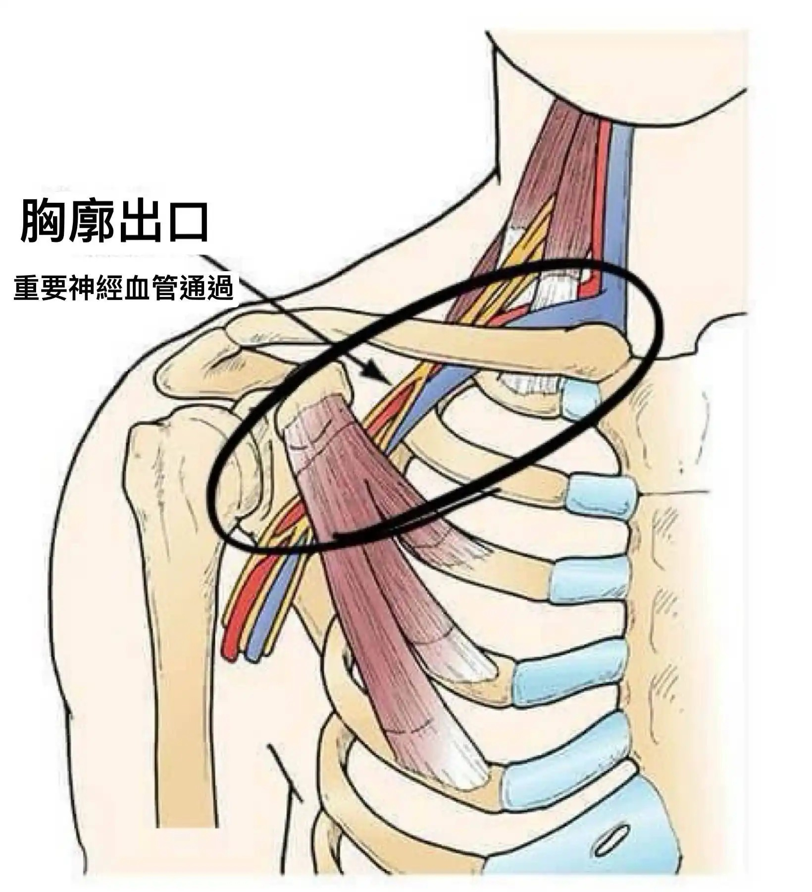

# Threads 貼文 DKIqFZqT0JA

- 帳號: [@drchenghao](https://www.threads.com/@drchenghao)（程皓醫師｜好動人生。 運動與家庭醫學，已認證）
- 貼文 URL: https://www.threads.com/@drchenghao/post/DKIqFZqT0JA
- 發文時間: 2025-05-27T07:30:18+08:00（UTC+8，時間戳 1748302218）
- 類型: photo
- 愛心數: 65
- 回覆數: 4
- 轉發數: 0
- 引用數: 1
- 備註: 貼文曾被編輯

## 貼文文字

❗Victor Wembanyama血栓，多久回得來❗

🫱懶人包：理論上，下季開季即有機會回歸。

回歸取決於能否找到可處理的原因，例如胸廓出口症候群，若能順利處理，可望完全康復，若否，則需要時刻注意是否復發，持續用藥預防並追蹤。

本季有兩位重要選手血栓，Damian Lillard 和Victor Wembanyama ，運動雖能預防許多慢性疾病，但高強度運動、反覆肢體動作、創傷後活動減少，都可能成為血栓的隱形推手。同時，職業運動員長途飛行也是重要危險因子。

而Wemby更為特別，上肢血栓同時需要考慮 "胸廓出口症候群" 的影響，可能為長期壓迫靜脈導致，有必要可以施行手術減少靜脈週邊壓力，放於附圖，留言處特別介紹

Wemby 或許可以參照 Brandon Ingram 的案例，當年發現是胸廓出口問題後，立即手術後，數個月即完美回歸，也期待他能以此方式順利回場！

## 圖片

- 原始圖片 URL: https://scontent-sin6-3.cdninstagram.com/v/t51.2885-15/501131572_17853838125446758_6013852701671098996_n.webp?efg=eyJ2ZW5jb2RlX3RhZyI6InRocmVhZHMuRkVFRC5pbWFnZV91cmxnZW4uMTY0MC5zZHIucmVndWxhcl9waG90by5jMiJ9&_nc_ht=scontent-sin6-3.cdninstagram.com&_nc_cat=110&_nc_oc=Q6cZ2gHU7Tc5xuZH8GIbIpMxf1csY9JaNhy7BvxCxyB4Go2AXuAAdATxF3qCZbAMkgYtFfibtsN-Ex-uxUJEJFUH8UOx&_nc_ohc=GfqUMtjpuUgQ7kNvwFDPM80&_nc_gid=Z4pEGXQZQqpNPxd-8YGyrQ&edm=APs17CUBAAAA&ccb=7-5&ig_cache_key=MzY0MTM0NTM4NzgzMzI3OTA0MA%3D%3D.3-ccb7-5&oh=00_AQJs4OLsCRM-q3MjEEYUC27JatH_53wQZHfqIk8Lq39wvw&oe=6AA5D779&_nc_sid=10d13b
- 尺寸: 1640x1799
