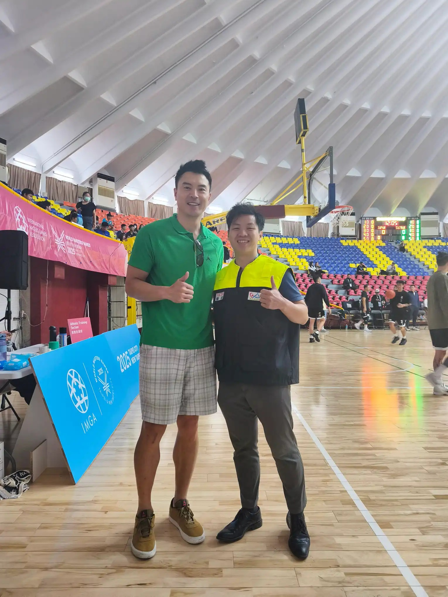

# Threads 貼文 DKOYuyhTH2v

- 帳號: [@drchenghao](https://www.threads.com/@drchenghao)（程皓醫師｜好動人生。 運動與家庭醫學，已認證）
- 貼文 URL: https://www.threads.com/@drchenghao/post/DKOYuyhTH2v
- 發文時間: 2025-05-29T12:54:06+08:00（UTC+8，時間戳 1748494446）
- 類型: photo
- 愛心數: 54
- 回覆數: 2
- 轉發數: 0
- 引用數: 0

## 貼文文字

擔任場邊醫師的小福利，安哥太帥啦

第一句話就是，我從小看你長大的呀🔥
想起當年SBL黃金年代，壘哥、志傑、阿鼎
沒想到有機會場邊遇到他，這次世壯運真值了

等下下午5點還有冠軍賽，
還有當年SBL小粉絲嗎，留言一起重溫一下❗

## 圖片

- 原始圖片 URL: https://scontent-sin6-3.cdninstagram.com/v/t51.2885-15/502469970_17854111413446758_5873402530134160579_n.webp?efg=eyJ2ZW5jb2RlX3RhZyI6InRocmVhZHMuRkVFRC5pbWFnZV91cmxnZW4uMTUzMC5zZHIucmVndWxhcl9waG90by5jMiJ9&_nc_ht=scontent-sin6-3.cdninstagram.com&_nc_cat=110&_nc_oc=Q6cZ2gHU7Tc5xuZH8GIbIpMxf1csY9JaNhy7BvxCxyB4Go2AXuAAdATxF3qCZbAMkgYtFfibtsN-Ex-uxUJEJFUH8UOx&_nc_ohc=B6_j9ST6eQYQ7kNvwH8j5Tw&_nc_gid=Z4pEGXQZQqpNPxd-8YGyrQ&edm=APs17CUBAAAA&ccb=7-5&ig_cache_key=MzY0Mjk1NzkxNzA0NzI1ODU0Mw%3D%3D.3-ccb7-5&oh=00_AQKLmkTY6S179t0rMeWC2dZuAjIj1Qk0pXTogw7GwbTe8A&oe=6AA5E604&_nc_sid=10d13b
- 尺寸: 1530x2040
