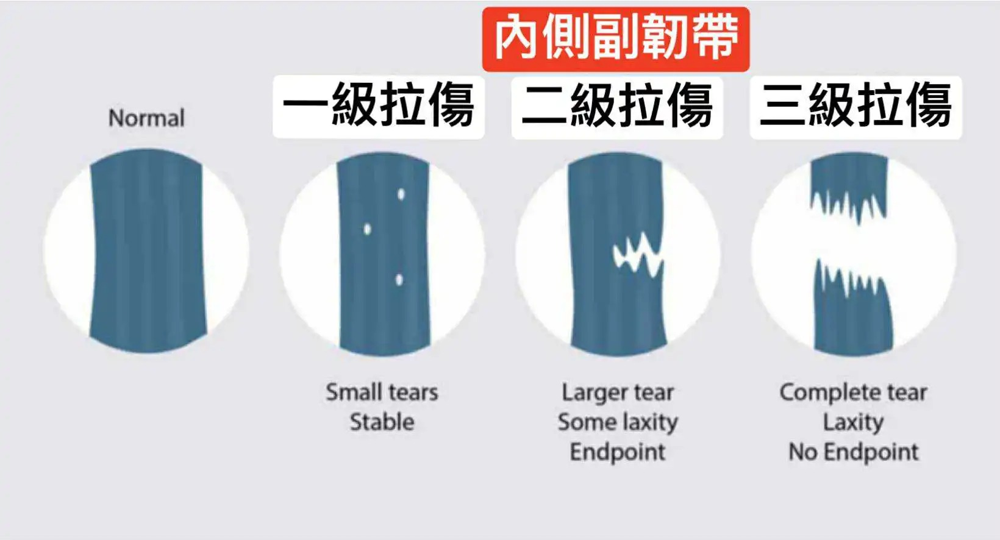

# Threads 貼文 DKYKVL3TITc

- 帳號: [@drchenghao](https://www.threads.com/@drchenghao)（程皓醫師｜好動人生。 運動與家庭醫學，已認證）
- 貼文 URL: https://www.threads.com/@drchenghao/post/DKYKVL3TITc
- 發文時間: 2025-06-02T08:00:41+08:00（UTC+8，時間戳 1748822441）
- 類型: photo
- 愛心數: 28
- 回覆數: 3
- 轉發數: 1
- 引用數: 0

## 貼文文字

❗湖人季後賽最後一場，LeBron James 內側副韌帶 2級拉傷，嚴重嗎❗

懶人包：開季可正常上場，保守治療搭配訓練及輔助治療即可 😎

內側副韌帶提供內側膝蓋穩定性，減少骨頭及周圍組織位移，受傷時會產生腫脹、疼痛、不穩定的症狀，也時常合併十字韌帶及半月板問題，必要時合併治療。

一級：輕度拉傷，休一週左右
二級：中度拉傷、具撕裂，休數週至一個月
三級：重度拉傷、完全撕裂，休一至二個月以上

一至二級拉傷以保守治療為主，藥物、適度肌力訓練強化股四頭、臀、核心等，搭配增生注射治療等。

三級拉傷合併鬆動及不穩定，考慮手術治療，術後復健訓練。

小結： LeBron這個傷，不需太過擔心，確認無其他合併問題後，好好治療即可繼續上場，延續他史詩級的得分記錄。🔥

## 圖片

- 原始圖片 URL: https://scontent-sin6-3.cdninstagram.com/v/t51.2885-15/503320999_17854598541446758_4716424134343803274_n.webp?efg=eyJ2ZW5jb2RlX3RhZyI6InRocmVhZHMuRkVFRC5pbWFnZV91cmxnZW4uMTY0MC5zZHIucmVndWxhcl9waG90by5jMiJ9&_nc_ht=scontent-sin6-3.cdninstagram.com&_nc_cat=110&_nc_oc=Q6cZ2gHU7Tc5xuZH8GIbIpMxf1csY9JaNhy7BvxCxyB4Go2AXuAAdATxF3qCZbAMkgYtFfibtsN-Ex-uxUJEJFUH8UOx&_nc_ohc=lqmDgbLobEMQ7kNvwEA0js3&_nc_gid=Z4pEGXQZQqpNPxd-8YGyrQ&edm=APs17CUBAAAA&ccb=7-5&ig_cache_key=MzY0NTcwOTMzNDY2OTQ2MDcwMA%3D%3D.3-ccb7-5&oh=00_AQLedowlyFdf81c8TixjSx5gHWWPqC5Dr2u4MlNjO3W-_g&oe=6AA5F0C2&_nc_sid=10d13b
- 尺寸: 1640x886
