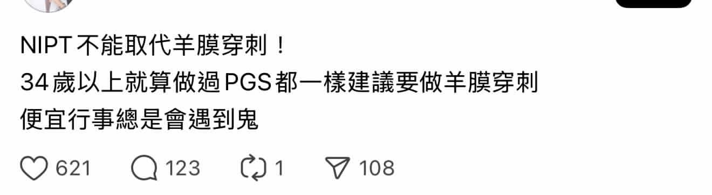

# Threads 貼文 DK_RWu2T8K6

- 帳號: [@drchenghao](https://www.threads.com/@drchenghao)（程皓醫師｜好動人生。 運動與家庭醫學，已認證）
- 貼文 URL: https://www.threads.com/@drchenghao/post/DK_RWu2T8K6
- 發文時間: 2025-06-17T12:32:26+08:00（UTC+8，時間戳 1750134746）
- 類型: photo
- 愛心數: 84
- 回覆數: 9
- 轉發數: 0
- 引用數: 0

## 貼文文字

偶有這種過度引發檢查焦慮的言論，
同樣地，羊膜穿刺也不能取代NIPT！
一個是抽血檢查，一個是侵入性檢查，
兩者評比本就不同。

若您是高齡產婦，評估羊穿流產的風險低於唐氏症的風險，當然可以選擇穿刺，出血流產是可以承受的就做。

但如果你是正常育齡，原本就風險不高的情況下，NIPT篩檢率是99.7%，風險已幾乎能降至最低，分享一下醫學實證及個人觀點而已，謝謝。

## 圖片

- 原始圖片 URL: https://scontent-sin6-3.cdninstagram.com/v/t51.2885-15/508662099_17857355700446758_4232148607185308253_n.jpg?stp=dst-jpg_e35_tt6&efg=eyJ2ZW5jb2RlX3RhZyI6InRocmVhZHMuRkVFRC5pbWFnZV91cmxnZW4uMTMyMC5zZHIucmVndWxhcl9waG90by5jMiJ9&_nc_ht=scontent-sin6-3.cdninstagram.com&_nc_cat=110&_nc_oc=Q6cZ2gFZ61IhroCeut3nQsq3PwKKDfjmTOSAyo085C0q5Y4IFSnKVXIwBph9cmsqozgt0ocUJ5NhnB7fRC5EHj5dBogG&_nc_ohc=yOjxAkLRgi0Q7kNvwEz4ppa&_nc_gid=UVi_GKGKlqIfM5O3U_S_XA&edm=APs17CUBAAAA&ccb=7-5&ig_cache_key=MzY1NjcxNzc1MTM3MDYyOTgxOA%3D%3D.3-ccb7-5&oh=00_AQI8uq56yzTMp5CI3aqWgbCXWPgsGUSZRCWsjBODEzLYfw&oe=6AA5D511&_nc_sid=10d13b
- 尺寸: 1320x363
