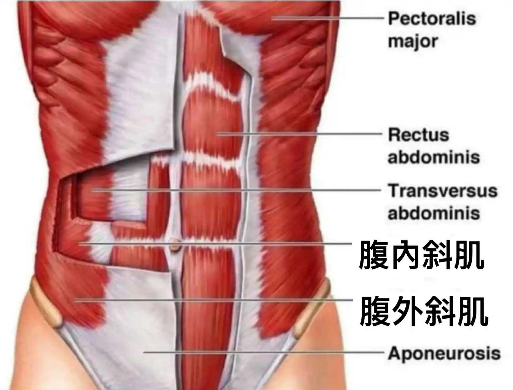

# Threads 貼文 DKeRmhJTG-O

- 帳號: [@drchenghao](https://www.threads.com/@drchenghao)（程皓醫師｜好動人生。 運動與家庭醫學，已認證）
- 貼文 URL: https://www.threads.com/@drchenghao/post/DKeRmhJTG-O
- 發文時間: 2025-06-04T16:59:40+08:00（UTC+8，時間戳 1749027580）
- 類型: photo
- 愛心數: 185
- 回覆數: 5
- 轉發數: 3
- 引用數: 0
- 備註: 貼文曾被編輯

## 貼文文字

❗古林睿煬緊急退場，是腹內斜肌拉傷❗
懶人包：休長達8週應該是出於保護選手，大部分皆能完美回歸。

腹內斜肌為腹肌三層中，位於中間層的位置，主要作為軀幹穩定、抗旋轉。

腹內斜肌拉傷為棒球選手好發的傷害之一，常見發生於高速旋轉時，通常會發生在非慣用手側。常見症狀為側腹部強烈刺痛，甚至咳嗽等也會有症狀。

有一研究顯示，平均回場時間大約為27天，但也需要視傷勢嚴重程度做調整，一年內也仍有30%會復發。

這次古林預計休8週，應該是以保護選手為第一考量，期待他能完美回歸。

## 圖片

- 原始圖片 URL: https://scontent-sin6-3.cdninstagram.com/v/t51.2885-15/504114015_17854901046446758_1804300020643734272_n.webp?efg=eyJ2ZW5jb2RlX3RhZyI6InRocmVhZHMuRkVFRC5pbWFnZV91cmxnZW4uMTY0MC5zZHIucmVndWxhcl9waG90by5jMiJ9&_nc_ht=scontent-sin6-3.cdninstagram.com&_nc_cat=110&_nc_oc=Q6cZ2gE9TDH8SLS8j4m-mY3_J7H9XvxNH65UoBQzFSj_tME9vo47y214osrP57EOeeowl_YJOI58vNfMcRmd8iJRE8_j&_nc_ohc=N56VXWri1moQ7kNvwELAQnI&_nc_gid=8C7AoicGauVODFv6mCDAzA&edm=APs17CUBAAAA&ccb=7-5&ig_cache_key=MzY0NzQzMDE2MTkzNjk2OTYxNA%3D%3D.3-ccb7-5&oh=00_AQL6yH13SQcurmoAAamH4OGvD7_cVOnx9NXXSqA7ZXC-pQ&oe=6AA5D980&_nc_sid=10d13b
- 尺寸: 1640x1245
