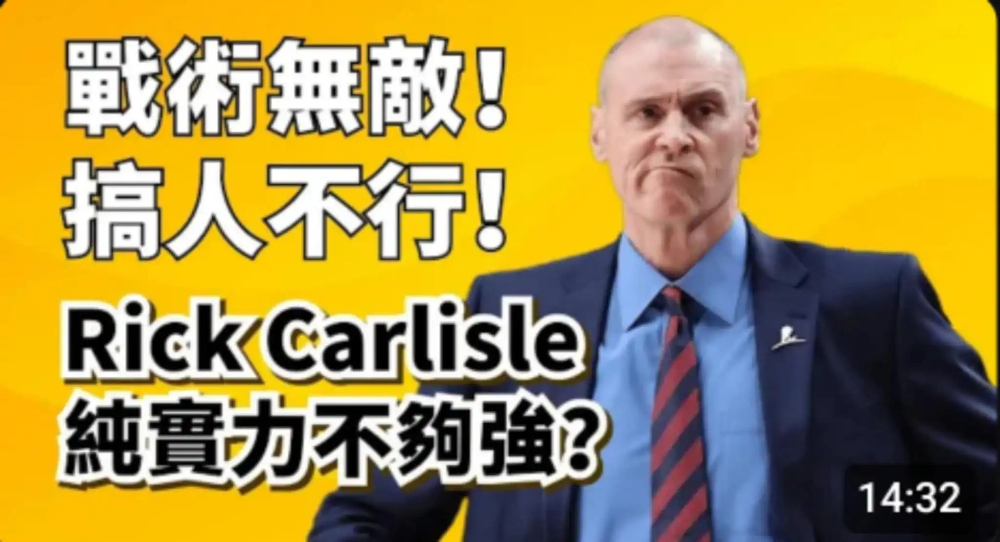

# Threads 貼文 DKmNIBaTf8a

- 帳號: [@drchenghao](https://www.threads.com/@drchenghao)（程皓醫師｜好動人生。 運動與家庭醫學，已認證）
- 貼文 URL: https://www.threads.com/@drchenghao/post/DKmNIBaTf8a
- 發文時間: 2025-06-07T18:54:28+08:00（UTC+8，時間戳 1749293668）
- 類型: photo
- 愛心數: 85
- 回覆數: 4
- 轉發數: 0
- 引用數: 0

## 貼文文字

溜馬雷霆 G2 賽前介紹：
❗Rick Carlisle，溜馬東區冠軍的幕後王牌❗

車神又一深度分析，
這次介紹目前純實力聯盟前5的總教練，Carlisle，也才讓我回憶起這位教練有多強。

曾當過NBA球員，成績平平。

當教練，出道即巔峰，
2002年於活塞執教就拿下最佳教練。

前往溜馬執教帶領球隊打出61勝戰績，卻不幸遇上奧本山事件。

前往獨行俠，帶領小牛、司機於2011年奪得總冠軍，也是近二十年最讓人激動的冠軍之一，一直到2021年才再次回到溜馬。

再次回到溜馬，於2025年再次帶領球隊重返總冠軍戰。

卡教練搭建體系能力無人能及，信奉團隊籃球，打造出一支支無超巨的強隊，期待他能帶領溜馬逆襲雷霆，創造奇蹟 🔥

## 圖片

- 原始圖片 URL: https://scontent-sin6-3.cdninstagram.com/v/t51.2885-15/504429597_17855300568446758_5356610936128246109_n.webp?efg=eyJ2ZW5jb2RlX3RhZyI6InRocmVhZHMuRkVFRC5pbWFnZV91cmxnZW4uMjA0OC5zZHIucmVndWxhcl9waG90by5jMiJ9&_nc_ht=scontent-sin6-3.cdninstagram.com&_nc_cat=110&_nc_oc=Q6cZ2gE9TDH8SLS8j4m-mY3_J7H9XvxNH65UoBQzFSj_tME9vo47y214osrP57EOeeowl_YJOI58vNfMcRmd8iJRE8_j&_nc_ohc=PektIpuGveUQ7kNvwEUwvWv&_nc_gid=8C7AoicGauVODFv6mCDAzA&edm=APs17CUBAAAA&ccb=7-5&ig_cache_key=MzY0OTY2MjI3MzkwNTg4NDk1NA%3D%3D.3-ccb7-5&oh=00_AQJ0IvdCxzSBtrdldWwIaZxFRaroE0K0U68h0XEQviw8Ug&oe=6AA5F9F0&_nc_sid=10d13b
- 尺寸: 2048x1111
