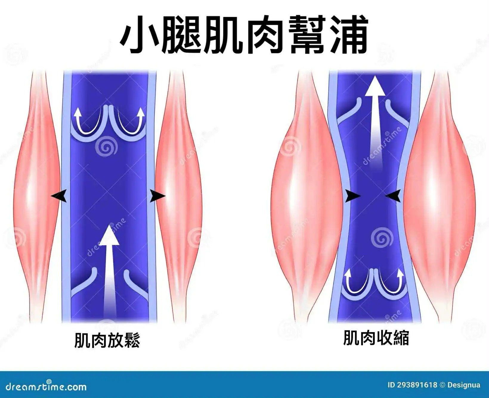

# Threads 貼文 DKqn3DSzpLm

- 帳號: [@drchenghao](https://www.threads.com/@drchenghao)（程皓醫師｜好動人生。 運動與家庭醫學，已認證）
- 貼文 URL: https://www.threads.com/@drchenghao/post/DKqn3DSzpLm
- 發文時間: 2025-06-09T12:05:03+08:00（UTC+8，時間戳 1749441903）
- 類型: photo
- 愛心數: 7
- 回覆數: 1
- 轉發數: 1
- 引用數: 0
- 備註: 此貼文為作者回覆自己的續文（self-thread），屬於同時發布的貼文群組 [DKqnOwDzVp_](https://www.threads.com/@drchenghao/post/DKqnOwDzVp_)

## 貼文文字

calf pump 幫助下肢靜脈回流

## 圖片

- 原始圖片 URL: https://scontent-sin6-3.cdninstagram.com/v/t51.2885-15/504382173_17855540280446758_3327965631039392427_n.webp?efg=eyJ2ZW5jb2RlX3RhZyI6InRocmVhZHMuRkVFRC5pbWFnZV91cmxnZW4uMTY0MC5zZHIucmVndWxhcl9waG90by5jMiJ9&_nc_ht=scontent-sin6-3.cdninstagram.com&_nc_cat=110&_nc_oc=Q6cZ2gE9TDH8SLS8j4m-mY3_J7H9XvxNH65UoBQzFSj_tME9vo47y214osrP57EOeeowl_YJOI58vNfMcRmd8iJRE8_j&_nc_ohc=Sy6-sCgkL_QQ7kNvwGv3SBo&_nc_gid=8C7AoicGauVODFv6mCDAzA&edm=APs17CUBAAAA&ccb=7-5&ig_cache_key=MzY1MDkwNTc1NDg1OTExNTIzOA%3D%3D.3-ccb7-5&oh=00_AQJ1sb-BM6Ze7ZntByFcpyKgisZ5KHduFd-YMyEZhD0zVQ&oe=6AA5F1CF&_nc_sid=10d13b
- 尺寸: 1640x1337
