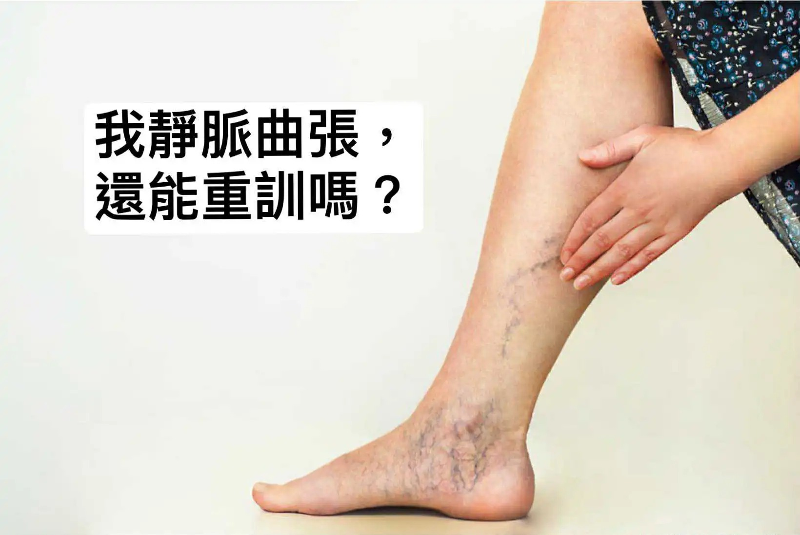

# Threads 貼文 DKqnOwDzVp_

- 帳號: [@drchenghao](https://www.threads.com/@drchenghao)（程皓醫師｜好動人生。 運動與家庭醫學，已認證）
- 貼文 URL: https://www.threads.com/@drchenghao/post/DKqnOwDzVp_
- 發文時間: 2025-06-09T11:59:32+08:00（UTC+8，時間戳 1749441572）
- 類型: photo
- 愛心數: 26
- 回覆數: 13
- 轉發數: 3
- 引用數: 1
- 備註: 貼文曾被編輯

## 貼文文字

❗健身必備小知識，談靜脈曲張與重訓❗

懶人包：輕中度訓練能夠幫助循環，減輕靜脈曲張，高強度訓練可能加劇症狀，但適當監控強度，依然能持續訓練🏋️

靜脈曲張是長時間維持同姿勢，血液蓄積下肢，靜脈瓣膜出問題導致。

風險因子：高齡、久站久坐、肥胖

主要預防及治療方法：
1. 使用醫療級彈性襪加壓，增加下肢靜脈回流。
2. 可定時或睡前腳抬高於心臟，幫助下肢靜脈回流。
3. 墊腳運動和輕中度運動，例如跑步等，也有幫助，只要能夠形成calf pump即可，詳見附圖。
4. 體重控制，減少下肢負擔。

***額外特別討論重訓：
下肢靜脈分為淺層和深層，下肢運動對於深層靜脈回流有幫助，並且必須是收縮放鬆交替才行，因此持續 腿部高負荷和閉氣不建議，例如持續 Valsalva maneuver，可能造成靜脈回流不易。
結合上述，因此訓練強度避免過高，80% 1RM 或是最大心率70%以下，緩慢循序漸進即可，不過這個無詳細研究，可視情況調整，且重訓對於淺層靜脈無幫助，可結合使用彈性襪。

另外補充，運動員的靜脈隆起，可能只是適應性變化，大多無症狀且不需擔心唷！
參考文獻放於留言，歡迎朋友留言指教！

## 圖片

- 原始圖片 URL: https://scontent-sin6-3.cdninstagram.com/v/t51.2885-15/504525193_17855539986446758_7598132081354377713_n.webp?efg=eyJ2ZW5jb2RlX3RhZyI6InRocmVhZHMuRkVFRC5pbWFnZV91cmxnZW4uMTY0MC5zZHIucmVndWxhcl9waG90by5jMiJ9&_nc_ht=scontent-sin6-3.cdninstagram.com&_nc_cat=110&_nc_oc=Q6cZ2gE9TDH8SLS8j4m-mY3_J7H9XvxNH65UoBQzFSj_tME9vo47y214osrP57EOeeowl_YJOI58vNfMcRmd8iJRE8_j&_nc_ohc=bYktP9bVubkQ7kNvwGcFPwC&_nc_gid=8C7AoicGauVODFv6mCDAzA&edm=APs17CUBAAAA&ccb=7-5&ig_cache_key=MzY1MDkwMjk4NTQyNzIxMjkyNw%3D%3D.3-ccb7-5&oh=00_AQIyBI1wVprQqtUiW7F8eN-_z07a15AmoaanhzNTQCCY_w&oe=6AA6047C&_nc_sid=10d13b
- 尺寸: 1640x1098
