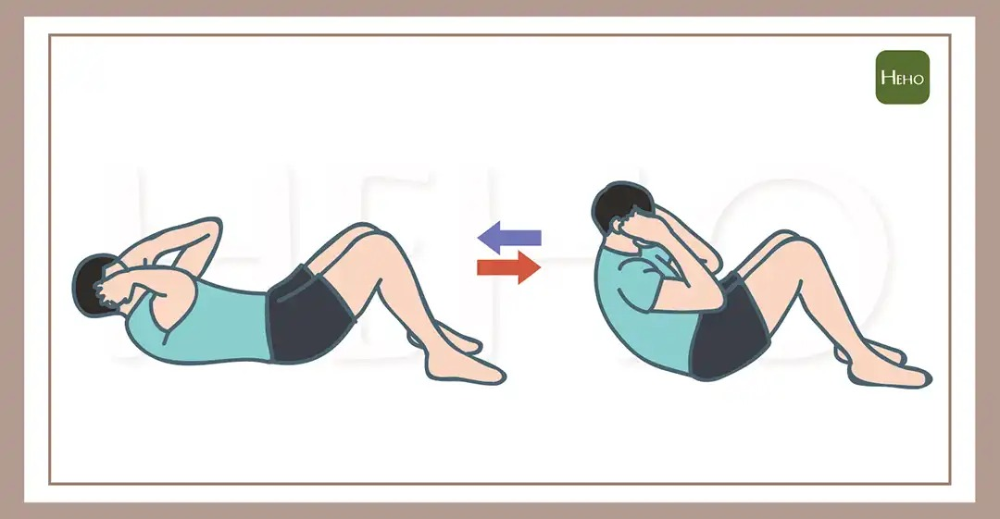

# Threads 貼文 DKwU8G_zyGY

- 帳號: [@drchenghao](https://www.threads.com/@drchenghao)（程皓醫師｜好動人生。 運動與家庭醫學，已認證）
- 貼文 URL: https://www.threads.com/@drchenghao/post/DKwU8G_zyGY
- 發文時間: 2025-06-11T17:15:09+08:00（UTC+8，時間戳 1749633309）
- 類型: photo
- 愛心數: 63
- 回覆數: 13
- 轉發數: 1
- 引用數: 0
- 備註: 貼文曾被編輯

## 貼文文字

［有趣小知識］
你知道小時後體適能最愛考的，仰臥起坐，已經從去年開始被換成「仰臥捲腹」了嗎！

主因，做為一個腹肌訓練，仰臥起坐欠缺功能性且容易導致腰椎容易受傷，甚至椎間盤凸出，不如選擇捲腹或是平板支撐等動作。

這次改動實屬一大進步，你又是從什麼時候開始不做仰臥起坐了呢？
留言一起來討論！

## 圖片

- 原始圖片 URL: https://scontent-sin6-3.cdninstagram.com/v/t51.2885-15/505772177_17855811462446758_8223708623898361741_n.webp?efg=eyJ2ZW5jb2RlX3RhZyI6InRocmVhZHMuRkVFRC5pbWFnZV91cmxnZW4uMTA4MC5zZHIucmVndWxhcl9waG90by5jMiJ9&_nc_ht=scontent-sin6-3.cdninstagram.com&_nc_cat=110&_nc_oc=Q6cZ2gE9TDH8SLS8j4m-mY3_J7H9XvxNH65UoBQzFSj_tME9vo47y214osrP57EOeeowl_YJOI58vNfMcRmd8iJRE8_j&_nc_ohc=eOycYW8Xr2UQ7kNvwH-QaEl&_nc_gid=8C7AoicGauVODFv6mCDAzA&edm=APs17CUBAAAA&ccb=7-5&ig_cache_key=MzY1MjUxMTM4OTQwOTI4ODYwMA%3D%3D.3-ccb7-5&oh=00_AQJBcLSyzwTALgukDB7OcYWlkb0IE2csx4iEYV_mP2Eeig&oe=6AA5DECA&_nc_sid=10d13b
- 尺寸: 1080x561
