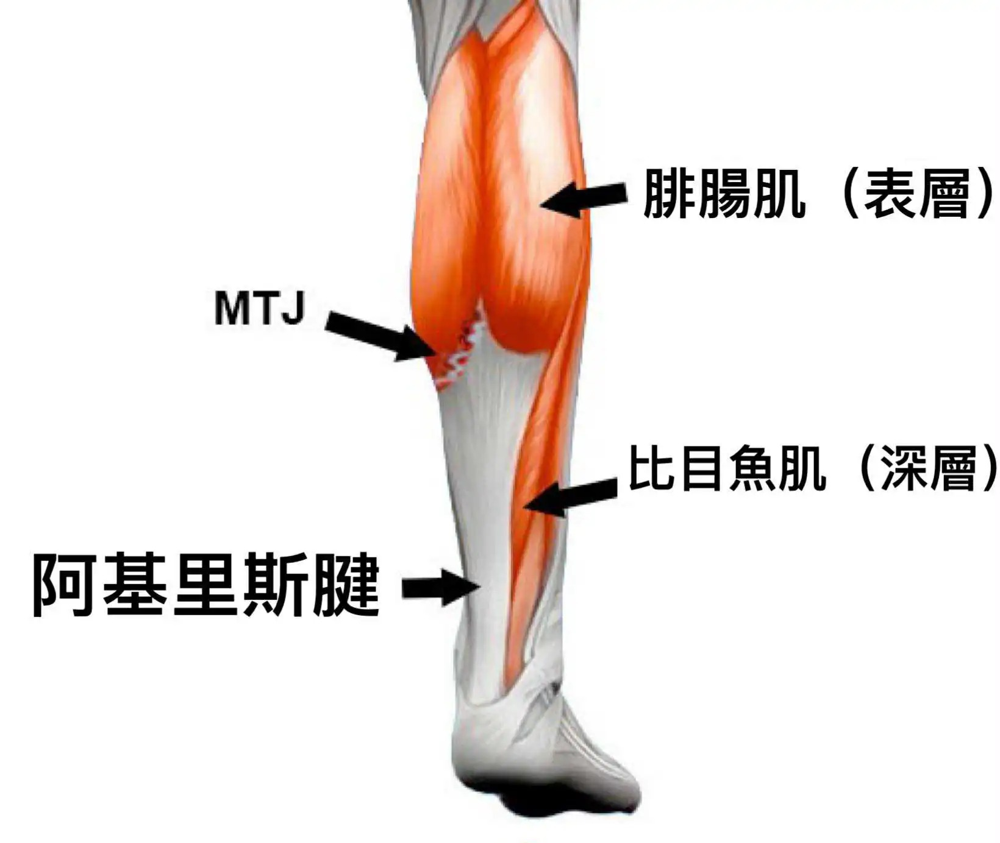

# Threads 貼文 DLCv8uTTn-f

- 帳號: [@drchenghao](https://www.threads.com/@drchenghao)（程皓醫師｜好動人生。 運動與家庭醫學，已認證）
- 貼文 URL: https://www.threads.com/@drchenghao/post/DLCv8uTTn-f
- 發文時間: 2025-06-18T20:57:30+08:00（UTC+8，時間戳 1750251450）
- 類型: photo
- 愛心數: 91
- 回覆數: 12
- 轉發數: 1
- 引用數: 4
- 備註: 貼文曾被編輯

## 貼文文字

❗Haliburton 小腿肌拉傷，嚴重嗎，能打嗎❗

溜馬雷霆G5，哈利賽後發現小腿肌拉傷，目前等待MRI結果。

❗懶人包：
哈利小腿肌拉傷，回場時間取決於他症狀嚴重程度跟功能性，若MRI檢查無嚴重撕裂，且無症狀，可直接上場拼戰，但再傷率高！
————————————————————
👉小腿肌撕裂傷如何發生？

小腿肌撕裂傷是相當常見的運動員傷害，常見於未熱身完全的運動員於變向或衝刺時發生，於網球選手發生時也被稱作網球腿。

👉小腿肌主要有哪些？

小腿肌群主要由表層腓腸肌和深層比目魚肌組成，各司其職。
腓腸肌撕裂傷較比目魚肌撕裂傷發生率更高。

👉多久能回場，該如何治療？

回場時間取決於受傷位置和嚴重程度，若是無症狀及影像上無明顯問題，則大概率能快速回場，且目前總冠軍賽第六戰，想必帶著傷病也會上場。

足球球員研究，若是比目魚肌中央腱膜傷 ，最嚴重，平均需44天才能回場。其他位置較輕微，最快約16天回場。
但再傷率可能高達30%。

後續透過增生治療，結合適當的物理治療及肌群訓練，大多數球員能完全恢復，無後遺症，讓我們一起來等待MRI結果吧！

留言附文章

## 圖片

- 原始圖片 URL: https://scontent-sin6-3.cdninstagram.com/v/t51.2885-15/509109348_17857707333446758_1391309173862630724_n.webp?efg=eyJ2ZW5jb2RlX3RhZyI6InRocmVhZHMuRkVFRC5pbWFnZV91cmxnZW4uMTY0MC5zZHIucmVndWxhcl9waG90by5jMiJ9&_nc_ht=scontent-sin6-3.cdninstagram.com&_nc_cat=110&_nc_oc=Q6cZ2gHuZCdLkx-YRPqfZdwpxYlXj5GYzJkEkDJgSTtwYlxPCJh2vNeyRfrqcDekOt_8JYcQpJ3dcFTtyKXxFRQJ5Y0L&_nc_ohc=0B8ycnNrljEQ7kNvwHSY5rQ&_nc_gid=VWNzMLh-EvvW7KcMwgHQig&edm=APs17CUBAAAA&ccb=7-5&ig_cache_key=MzY1NzY5NjcyODQ0ODkyNTU5OQ%3D%3D.3-ccb7-5&oh=00_AQLytQN5GdGESXPtCHysapkWkR_2qU8A-nobbO7ovmKM7A&oe=6AA5FAE4&_nc_sid=10d13b
- 尺寸: 1640x1384
