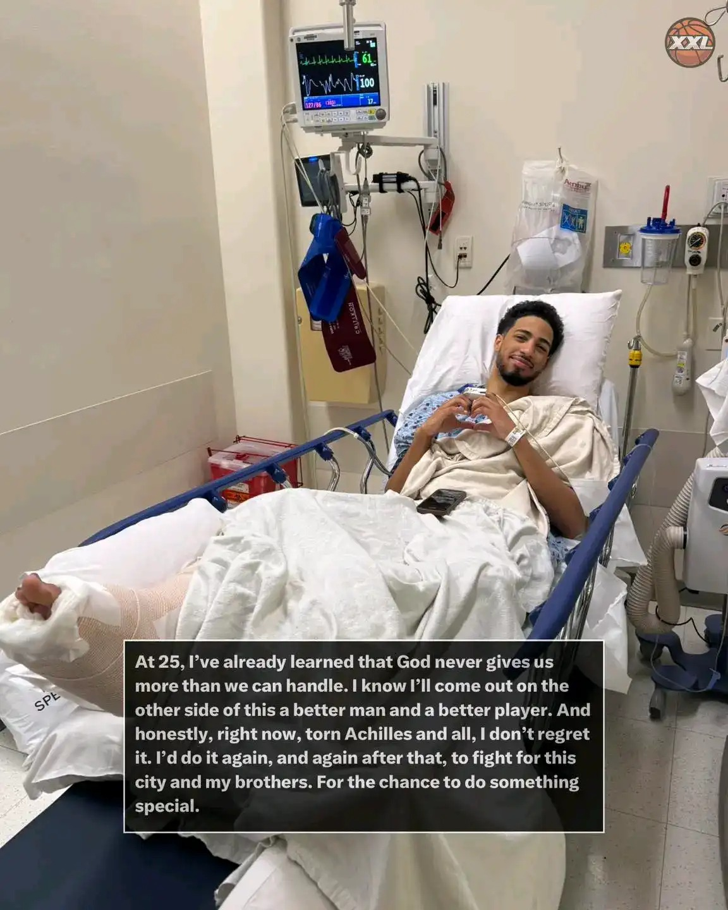

# Threads 貼文 DLROCc6TnVU

- 帳號: [@drchenghao](https://www.threads.com/@drchenghao)（程皓醫師｜好動人生。 運動與家庭醫學，已認證）
- 貼文 URL: https://www.threads.com/@drchenghao/post/DLROCc6TnVU
- 發文時間: 2025-06-24T11:49:47+08:00（UTC+8，時間戳 1750736987）
- 類型: photo
- 愛心數: 398
- 回覆數: 26
- 轉發數: 0
- 引用數: 0
- 備註: 貼文曾被編輯

## 貼文文字

❗ Haliburton 傷勢更新，台灣時間 6/24 11:30❗
Hali 阿基里斯腱手術順利！🔥
來複習之前有趣的小知識，為什麼阿基里斯腱撕裂都能立即手術後po文？

因為目前大多建議1週，甚至48小時內就進行手術修補，因為等待時間越久，肌腱的斷端會開始回縮，產生疤痕組織，手術也會更難進行。

所以會發現阿基里斯腱手術是最快的，反而前十字韌帶幾週後才手術，就幾乎沒什麼消息唷！

目前哈利預計回場時間至少是明年季後賽了，一起為他祝福！
留言附 Tatum、KD

## 圖片

- 原始圖片 URL: https://scontent-sin6-3.cdninstagram.com/v/t51.2885-15/512416693_17859645462446758_3340741029526099562_n.webp?efg=eyJ2ZW5jb2RlX3RhZyI6InRocmVhZHMuRkVFRC5pbWFnZV91cmxnZW4uMTE1Mi5zZHIucmVndWxhcl9waG90by5jMiJ9&_nc_ht=scontent-sin6-3.cdninstagram.com&_nc_cat=110&_nc_oc=Q6cZ2gFJFk_9hPVM0-hPex9nuH8UH0Wi8qmfZR2aZKI74Cu-kL4X8IpcPCKHJy4wSS6svbYBDU5R8CqRb7WQwKDzXv1W&_nc_ohc=cQf74ReW9qwQ7kNvwF7Dvc1&_nc_gid=3XewSz3m6HhR3R5rKTbjFQ&edm=APs17CUBAAAA&ccb=7-5&ig_cache_key=MzY2MTc2OTcxMzE2MjAyNDI3Ng%3D%3D.3-ccb7-5&oh=00_AQKq-aOKXqkPP3iiDHbSW50j9fxUsKBEkAQ1z3I9yQZdLQ&oe=6AA5E8B5&_nc_sid=10d13b
- 尺寸: 1152x1440
