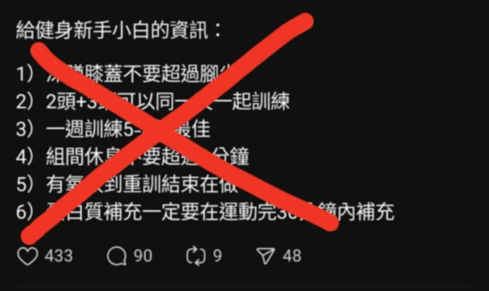

# Threads 貼文 DLeQLhETN3f

- 帳號: [@drchenghao](https://www.threads.com/@drchenghao)（程皓醫師｜好動人生。 運動與家庭醫學，已認證）
- 貼文 URL: https://www.threads.com/@drchenghao/post/DLeQLhETN3f
- 發文時間: 2025-06-29T13:18:38+08:00（UTC+8，時間戳 1751174318）
- 類型: photo
- 愛心數: 279
- 回覆數: 26
- 轉發數: 18
- 引用數: 3
- 備註: 貼文曾被編輯

## 貼文文字

健身必備小知識，ep11，常見疑問：
奇怪文章，
就拜託各位不要再回文幫它頂上去了

1）深蹲，腳尖與膝蓋不是重點，可參考，但最重要是深蹲動作模式正確與否，請找教練

2）二三頭可以一起練，不過不是很重要

3）一週3至4次練習，對身體疲勞已經很大了，要有足夠時間修復，練才有用

4）訓練強度決定組間休息時間

5）目前沒有相關研究，依照自己喜好及能力即可（若是職業運動員，週期化訓練需額外安排）

6）錯最大，2-4小時內補充碳水及少量蛋白即可，就可補充流失肝醣，詳見我之前文章

## 圖片

- 原始圖片 URL: https://scontent-sin6-3.cdninstagram.com/v/t51.2885-15/513837642_17861296131446758_5220804162203993103_n.webp?efg=eyJ2ZW5jb2RlX3RhZyI6InRocmVhZHMuRkVFRC5pbWFnZV91cmxnZW4uMTIyMC5zZHIucmVndWxhcl9waG90by5jMiJ9&_nc_ht=scontent-sin6-3.cdninstagram.com&_nc_cat=110&_nc_oc=Q6cZ2gFJFk_9hPVM0-hPex9nuH8UH0Wi8qmfZR2aZKI74Cu-kL4X8IpcPCKHJy4wSS6svbYBDU5R8CqRb7WQwKDzXv1W&_nc_ohc=iU6i8NxYRRQQ7kNvwEUL-qm&_nc_gid=3XewSz3m6HhR3R5rKTbjFQ&edm=APs17CUBAAAA&ccb=7-5&ig_cache_key=MzY2NTQzODMwNjg5MDIxMDc4Mw%3D%3D.3-ccb7-5&oh=00_AQLtrvABYvd7gGDGHncJTBEz20mUyXOX4qU86YOU-DIjyA&oe=6AA5E703&_nc_sid=10d13b
- 尺寸: 1220x728
