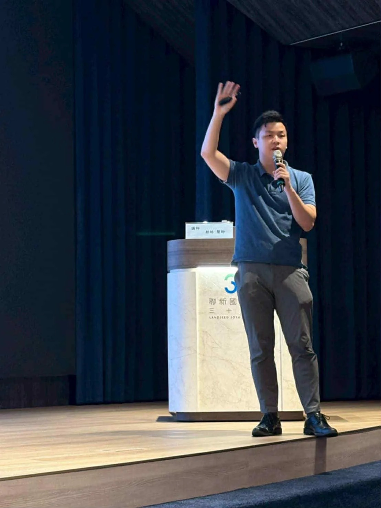

# Threads 貼文 DLexXRGz9OJ

- 帳號: [@drchenghao](https://www.threads.com/@drchenghao)（程皓醫師｜好動人生。 運動與家庭醫學，已認證）
- 貼文 URL: https://www.threads.com/@drchenghao/post/DLexXRGz9OJ
- 發文時間: 2025-06-29T18:08:35+08:00（UTC+8，時間戳 1751191715）
- 類型: photo
- 愛心數: 33
- 回覆數: 9
- 轉發數: 0
- 引用數: 0

## 貼文文字

首次在100多位教練前演講，
6/28 教練增能講習，演講主題為，
運動醫學與營養補充，怎麼吃才能幹大事。

除了瞭解各種營養素及菜單外，
也將這段期間研究的的運動補劑做個整理，讓教練們對這些合法的運動表現增強品項有所認識，也剛好最近在Threads上分享的內容🎉

不過我覺得最難的部分，應該是教練如何將資訊傳達給學生們吧 😂 辛苦教練了，也期待能持續傳達運動知識給小球員們。

## 圖片

- 原始圖片 URL: https://scontent-sin6-3.cdninstagram.com/v/t51.2885-15/513865969_17861328492446758_7584839752343156_n.webp?efg=eyJ2ZW5jb2RlX3RhZyI6InRocmVhZHMuRkVFRC5pbWFnZV91cmxnZW4uMTEwOC5zZHIucmVndWxhcl9waG90by5jMiJ9&_nc_ht=scontent-sin6-3.cdninstagram.com&_nc_cat=110&_nc_oc=Q6cZ2gFJFk_9hPVM0-hPex9nuH8UH0Wi8qmfZR2aZKI74Cu-kL4X8IpcPCKHJy4wSS6svbYBDU5R8CqRb7WQwKDzXv1W&_nc_ohc=GXuSMF83gVgQ7kNvwFT0Pl6&_nc_gid=3XewSz3m6HhR3R5rKTbjFQ&edm=APs17CUBAAAA&ccb=7-5&ig_cache_key=MzY2NTU4NDI0OTkyMTA2NTg2NQ%3D%3D.3-ccb7-5&oh=00_AQKlqm3Ad0FulVZZpTVJH0CwLBckigO1yoCePLItqpBIKw&oe=6AA5F060&_nc_sid=10d13b
- 尺寸: 1108x1477
