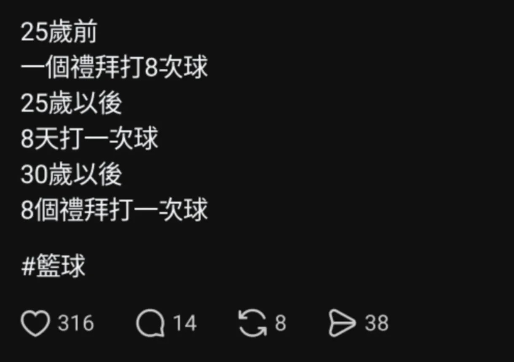

# Threads 貼文 DMAPIpLTqg7

- 帳號: [@drchenghao](https://www.threads.com/@drchenghao)（程皓醫師｜好動人生。 運動與家庭醫學，已認證）
- 貼文 URL: https://www.threads.com/@drchenghao/post/DMAPIpLTqg7
- 發文時間: 2025-07-12T18:03:41+08:00（UTC+8，時間戳 1752314621）
- 類型: photo
- 愛心數: 73
- 回覆數: 8
- 轉發數: 1
- 引用數: 0
- 備註: 貼文曾被編輯

## 貼文文字

看到文章有感而發，為什麼籃球好像都打不久？

籃球它其實是競技、接觸型運動，
對體能、對身體各位置肌力要求非常高，

如果平時沒有適當肌力訓練，
跟人打球就是在挑戰自己膝蓋、阿基里斯腱、肌力的能耐，就是在賭，

如果還想打球，你不該坐著怨嘆籃球打不久，
也不該每日熱敷、電療，這完全沒有幫助，
你需要的是找個懂運動的醫師、物治、教練，
而後適當的肌力訓練，
幫你重回球場。

從國中開始打球，23歲接觸肌力訓練後，
打到現在沒受過大傷，共勉之，

歡迎留言分享討論，看看之前文章🔥

## 圖片

- 原始圖片 URL: https://scontent-sin6-3.cdninstagram.com/v/t51.82787-15/518383415_17865140292446758_7227677648132317246_n.webp?efg=eyJ2ZW5jb2RlX3RhZyI6InRocmVhZHMuRkVFRC5pbWFnZV91cmxnZW4uMTIyMC5zZHIucmVndWxhcl9waG90by5jMiJ9&_nc_ht=scontent-sin6-3.cdninstagram.com&_nc_cat=110&_nc_oc=Q6cZ2gEuUpehhgdRViJpHLVJzmY38_vKXCblXAB4eeeMnco-2VliPAg8k9rI8fBPfca-5QxCrEWNsBGqXfuVEGp9ywqI&_nc_ohc=pgN9PWn_ReYQ7kNvwEsUurQ&_nc_gid=fnRO6zIKBD2K61_PUIpMYQ&edm=APs17CUBAAAA&ccb=7-5&ig_cache_key=MzY3NTAwMzg2MDYwMDkyNDIxOQ%3D%3D.3-ccb7-5&oh=00_AQLmlZcUssKYGYBq67D8MsS83rlvXdMEY9vfYHxbg9HbUA&oe=6AA60090&_nc_sid=10d13b
- 尺寸: 1220x859
