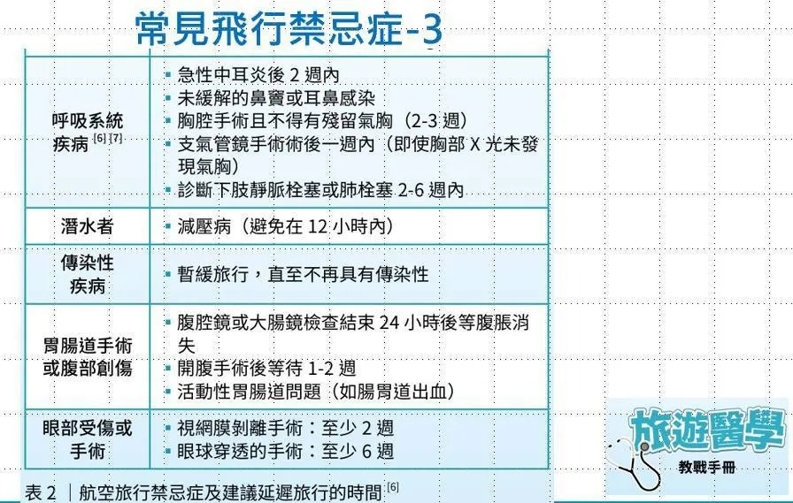

# Threads 貼文 DMSTIP0T93o

- 帳號: [@drchenghao](https://www.threads.com/@drchenghao)（程皓醫師｜好動人生。 運動與家庭醫學，已認證）
- 貼文 URL: https://www.threads.com/@drchenghao/post/DMSTIP0T93o
- 發文時間: 2025-07-19T18:24:54+08:00（UTC+8，時間戳 1752920694）
- 類型: photo
- 愛心數: 291
- 回覆數: 2
- 轉發數: 11
- 引用數: 3
- 備註: 此貼文為作者回覆自己的續文（self-thread），屬於同時發布的貼文群組 [DMSNnkjTf_-](https://www.threads.com/@drchenghao/post/DMSNnkjTf_-)

## 貼文文字

補上飛行禁忌症，尤其是手術的，建議時間不要抓太緊

## 圖片

- 原始圖片 URL: https://scontent-sin6-3.cdninstagram.com/v/t51.82787-15/522228164_17867058945446758_7009290823599009161_n.webp?efg=eyJ2ZW5jb2RlX3RhZyI6InRocmVhZHMuRkVFRC5pbWFnZV91cmxnZW4uODk2LnNkci5yZWd1bGFyX3Bob3RvLmMyIn0&_nc_ht=scontent-sin6-3.cdninstagram.com&_nc_cat=110&_nc_oc=Q6cZ2gEuUpehhgdRViJpHLVJzmY38_vKXCblXAB4eeeMnco-2VliPAg8k9rI8fBPfca-5QxCrEWNsBGqXfuVEGp9ywqI&_nc_ohc=eRTrsynvpnoQ7kNvwHuBniD&_nc_gid=fnRO6zIKBD2K61_PUIpMYQ&edm=APs17CUBAAAA&ccb=7-5&ig_cache_key=MzY4MDA4Nzk3NTEzODQxODE1Mg%3D%3D.3-ccb7-5&oh=00_AQJe5Pc1RYU79cLgHqDJdAxkfBeaatH33lpJhW9OvZgpWQ&oe=6AA5E20A&_nc_sid=10d13b
- 尺寸: 896x569
