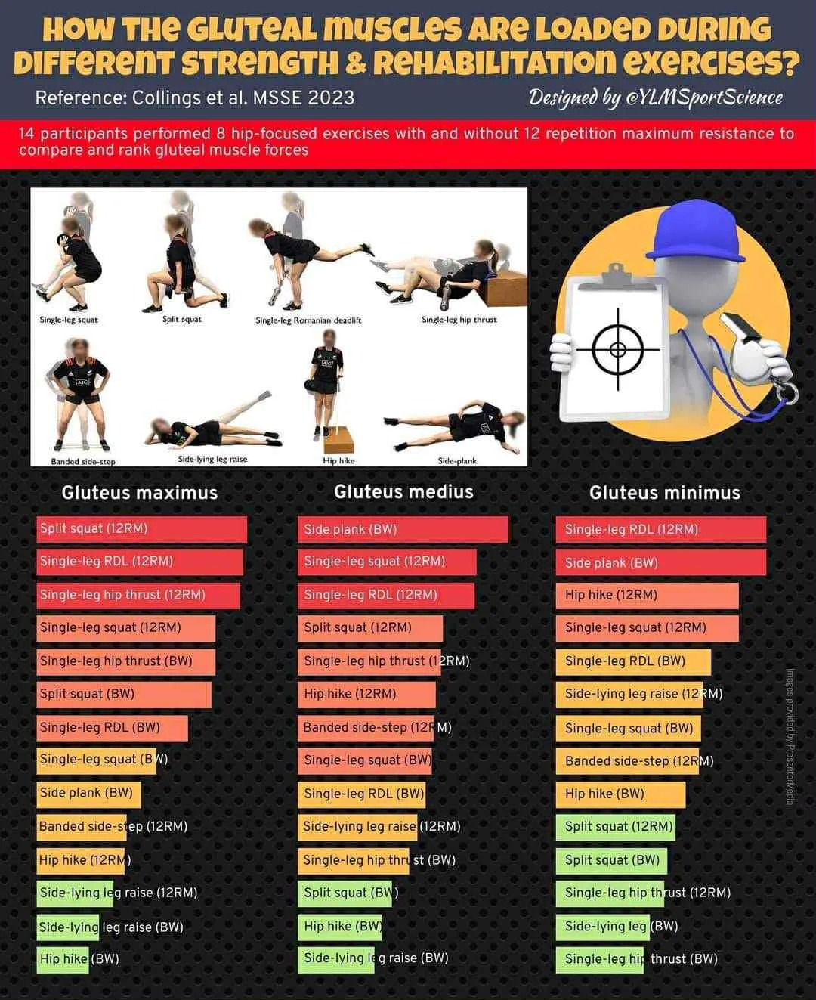

# Threads 貼文 DMfK4qJz4_b

- 帳號: [@drchenghao](https://www.threads.com/@drchenghao)（程皓醫師｜好動人生。 運動與家庭醫學，已認證）
- 貼文 URL: https://www.threads.com/@drchenghao/post/DMfK4qJz4_b
- 發文時間: 2025-07-24T18:23:00+08:00（UTC+8，時間戳 1753352580）
- 類型: photo
- 愛心數: 9
- 回覆數: 0
- 轉發數: 1
- 引用數: 0
- 備註: 此貼文為作者回覆自己的續文（self-thread），屬於同時發布的貼文群組 [DMfKnUczlZY](https://www.threads.com/@drchenghao/post/DMfKnUczlZY)

## 貼文文字

https://pubmed.ncbi.nlm.nih.gov/36918403/

## 圖片

- 原始圖片 URL: https://scontent-sin6-3.cdninstagram.com/v/t51.82787-15/523936468_17868815502446758_6468133100932930651_n.webp?efg=eyJ2ZW5jb2RlX3RhZyI6InRocmVhZHMuRkVFRC5pbWFnZV91cmxnZW4uMTA4MC5zZHIucmVndWxhcl9waG90by5jMiJ9&_nc_ht=scontent-sin6-3.cdninstagram.com&_nc_cat=110&_nc_oc=Q6cZ2gFRPIfffl9k1rLXRLSHf6KREJ2RAuhtT70v4HMDV65jwV5XvAFXTt2MCApBY6q3ZoYM29Ee6ajUeA0-FkUH6ps5&_nc_ohc=8Al-XmSy8zEQ7kNvwF2Ja9s&_nc_gid=7naXu_K9hWOSkM9qHPsI3g&edm=APs17CUBAAAA&ccb=7-5&ig_cache_key=MzY4MzcxMDg5NDIyOTkxNzY1OQ%3D%3D.3-ccb7-5&oh=00_AQIyliCoVDqAQ9dJENmKihUkHhtjjG11KxhqF12ozWoNnA&oe=6AA5FEE0&_nc_sid=10d13b
- 尺寸: 1080x1323
