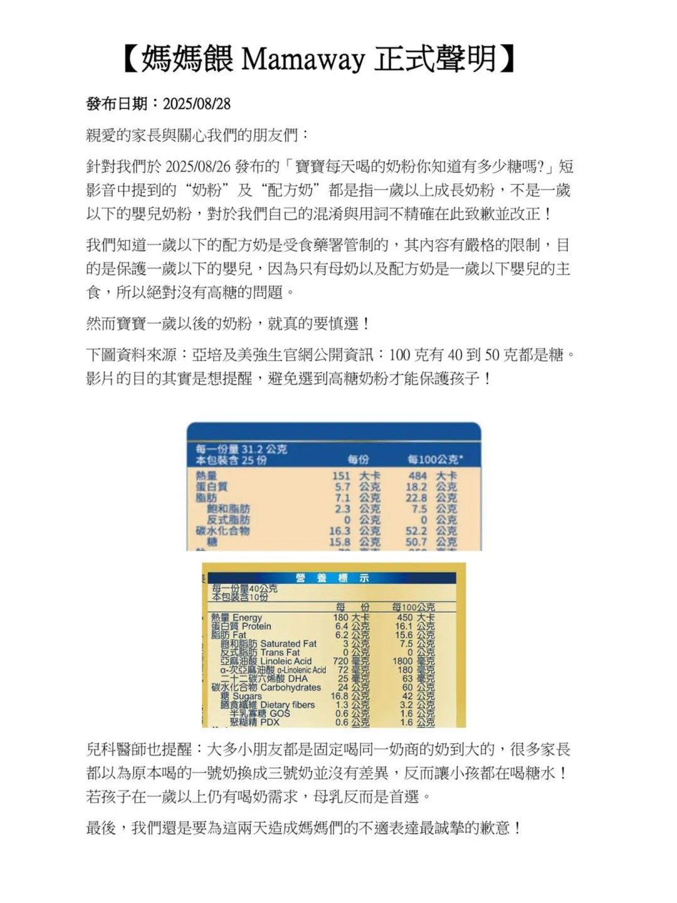

# Threads 貼文 DN5mZSMkyDQ

- 帳號: [@drchenghao](https://www.threads.com/@drchenghao)（程皓醫師｜好動人生。 運動與家庭醫學，已認證）
- 貼文 URL: https://www.threads.com/@drchenghao/post/DN5mZSMkyDQ
- 發文時間: 2025-08-28T21:15:02+08:00（UTC+8，時間戳 1756386902）
- 類型: photo
- 愛心數: 2749
- 回覆數: 169
- 轉發數: 41
- 引用數: 11

## 貼文文字

欸不是，竟然會去招惹嬰兒奶粉大品牌，
亞培、美強生，身為這兩家的忠實用戶，
真的覺得Mamaway在提油救火呀

奶粉裡的乳糖是必要成份，且對寶寶好處多多，並非所謂的「高糖」奶粉

且看這齣戲到底能延燒到何時呢😅

## 圖片

- 原始圖片 URL: https://scontent-sin6-3.cdninstagram.com/v/t51.82787-15/539365096_17878918614446758_7277411023508261178_n.webp?efg=eyJ2ZW5jb2RlX3RhZyI6InRocmVhZHMuRkVFRC5pbWFnZV91cmxnZW4uMTA4MC5zZHIucmVndWxhcl9waG90by5jMiJ9&_nc_ht=scontent-sin6-3.cdninstagram.com&_nc_cat=110&_nc_oc=Q6cZ2gHz9dZ9sDlXfBfGmvnGn9IwoN9gXA6hOj-VYt9ZeeT6Xl0jxmNE-GbfT0aaxLAHsIPY3OJjli2qsl96QAAbE68i&_nc_ohc=jRoAXJzjX-0Q7kNvwGMWLdt&_nc_gid=2L2tKG7Xb6KP9-0GqX5nRQ&edm=APs17CUBAAAA&ccb=7-5&ig_cache_key=MzcwOTE2NDYzMTQwODk3NjA4MA%3D%3D.3-ccb7-5&oh=00_AQL1KFdKNkKYlJnxsKQoh9alB6BjdH6yVPuxTXazIvWjLA&oe=6AA5DBAF&_nc_sid=10d13b
- 尺寸: 1080x1440
