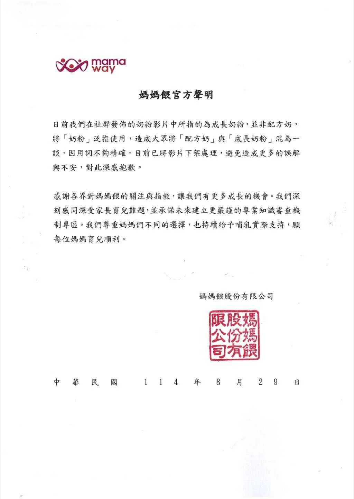

# Threads 貼文 DN7zPEIk_Gd

- 帳號: [@drchenghao](https://www.threads.com/@drchenghao)（程皓醫師｜好動人生。 運動與家庭醫學，已認證）
- 貼文 URL: https://www.threads.com/@drchenghao/post/DN7zPEIk_Gd
- 發文時間: 2025-08-29T17:45:43+08:00（UTC+8，時間戳 1756460743）
- 類型: photo
- 愛心數: 51
- 回覆數: 10
- 轉發數: 0
- 引用數: 0
- 備註: 貼文曾被編輯

## 貼文文字

繼食藥署、國建署、各科醫師，
亞培、美強生兩大公司發出聲明稿後，
Mamaway 投降啦~

不過看起來還有點搞不太清楚狀況，
實際上，不管是配方乳或成長奶粉，
裡面主要糖份來源皆為乳糖，
並非精緻糖，與之前影片中說法還是有落差

會就此落幕嗎，讓我們繼續看下去🔥

## 圖片

- 原始圖片 URL: https://scontent-sin6-3.cdninstagram.com/v/t51.82787-15/540104802_17879150601446758_8875022382920018601_n.webp?efg=eyJ2ZW5jb2RlX3RhZyI6InRocmVhZHMuRkVFRC5pbWFnZV91cmxnZW4uMTAyNC5zZHIucmVndWxhcl9waG90by5jMiJ9&_nc_ht=scontent-sin6-3.cdninstagram.com&_nc_cat=110&_nc_oc=Q6cZ2gHz9dZ9sDlXfBfGmvnGn9IwoN9gXA6hOj-VYt9ZeeT6Xl0jxmNE-GbfT0aaxLAHsIPY3OJjli2qsl96QAAbE68i&_nc_ohc=R4uwFDwXUQkQ7kNvwFR_fRF&_nc_gid=2L2tKG7Xb6KP9-0GqX5nRQ&edm=APs17CUBAAAA&ccb=7-5&ig_cache_key=MzcwOTc4NDA1MzY3MjgzMzQzNw%3D%3D.3-ccb7-5&oh=00_AQI-tnqaEObONCE29RYlJYe-XKo3cqIGLvabKG9j765IZg&oe=6AA5DBC4&_nc_sid=10d13b
- 尺寸: 1024x1440
