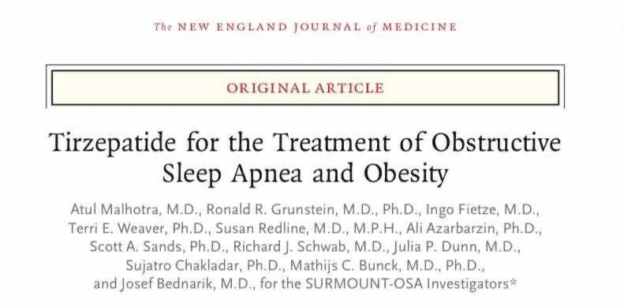

# Threads 貼文 DNDhVS8Tb9x

- 帳號: [@drchenghao](https://www.threads.com/@drchenghao)（程皓醫師｜好動人生。 運動與家庭醫學，已認證）
- 貼文 URL: https://www.threads.com/@drchenghao/post/DNDhVS8Tb9x
- 發文時間: 2025-08-07T21:11:48+08:00（UTC+8，時間戳 1754572308）
- 類型: photo
- 愛心數: 8
- 回覆數: 0
- 轉發數: 0
- 引用數: 0
- 備註: 此貼文為作者回覆自己的續文（self-thread），屬於同時發布的貼文群組 [DNDhJvSTRxH](https://www.threads.com/@drchenghao/post/DNDhJvSTRxH)

## 貼文文字

猛健樂治療睡眠呼吸中止症和肥胖

## 圖片

- 原始圖片 URL: https://scontent-sin6-3.cdninstagram.com/v/t51.82787-15/528876999_17873168892446758_758438955607542846_n.webp?efg=eyJ2ZW5jb2RlX3RhZyI6InRocmVhZHMuRkVFRC5pbWFnZV91cmxnZW4uNzkxLnNkci5yZWd1bGFyX3Bob3RvLmMyIn0&_nc_ht=scontent-sin6-3.cdninstagram.com&_nc_cat=110&_nc_oc=Q6cZ2gHz--iadCAaiaj5NOTp9asdVN7vsQI1z9ZjBVdtZDeoWVHxmqg8q5N9JJIGwp9Wq-2EvwgDsQqo2oPT6qmfoqRJ&_nc_ohc=KDZdvfLqKHYQ7kNvwFdHzX3&_nc_gid=_kn-gV9hUQowYa-ZzeG-Kg&edm=APs17CUBAAAA&ccb=7-5&ig_cache_key=MzY5Mzk0MjcxODM1Njg5NzY0OQ%3D%3D.3-ccb7-5&oh=00_AQKCRYX42Nr22-JaM4IqdkzmQXqPXXkkytTzY-wJdbS9DA&oe=6AA5EFC1&_nc_sid=10d13b
- 尺寸: 791x389
