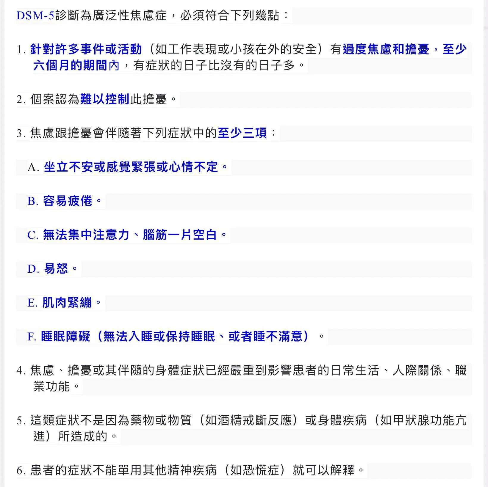

# Threads 貼文 DNQLsquzhDQ

- 帳號: [@drchenghao](https://www.threads.com/@drchenghao)（程皓醫師｜好動人生。 運動與家庭醫學，已認證）
- 貼文 URL: https://www.threads.com/@drchenghao/post/DNQLsquzhDQ
- 發文時間: 2025-08-12T19:12:53+08:00（UTC+8，時間戳 1754997173）
- 類型: photo
- 愛心數: 15
- 回覆數: 0
- 轉發數: 0
- 引用數: 0
- 備註: 此貼文為作者回覆自己的續文（self-thread），屬於同時發布的貼文群組 [DNQLhvlTZKW](https://www.threads.com/@drchenghao/post/DNQLhvlTZKW)

## 貼文文字

焦慮症診斷標準

## 圖片

- 原始圖片 URL: https://scontent-sin6-3.cdninstagram.com/v/t51.82787-15/530942346_17874525168446758_7731891054745379904_n.webp?efg=eyJ2ZW5jb2RlX3RhZyI6InRocmVhZHMuRkVFRC5pbWFnZV91cmxnZW4uMTY0MC5zZHIucmVndWxhcl9waG90by5jMiJ9&_nc_ht=scontent-sin6-3.cdninstagram.com&_nc_cat=110&_nc_oc=Q6cZ2gFnFYx0knvY7MiTXzNKSl5opPreLw0fu_RnlbxVIRqmxLxn3BOdwNIfnjf-g2KfMwDt60ycET5NE0Y4oD6otwqo&_nc_ohc=VdnX5dIA7IwQ7kNvwHKdw8u&_nc_gid=1m6da5xvSOikjj60I2PAnQ&edm=APs17CUBAAAA&ccb=7-5&ig_cache_key=MzY5NzUwNjc0MjEyMjE4OTAwOA%3D%3D.3-ccb7-5&oh=00_AQLbTvd5E28VS5hIF0_ezatTUMSowsPTXkjXcEyJTO0xeA&oe=6AA5DA17&_nc_sid=10d13b
- 尺寸: 1640x1638
