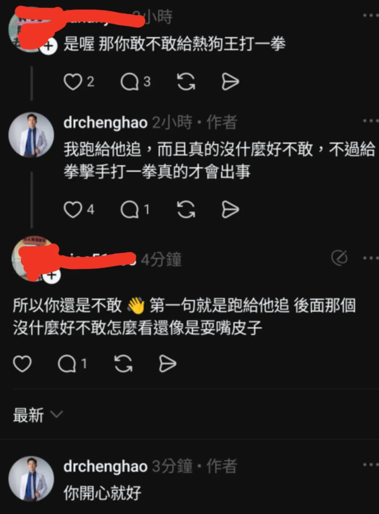

# Threads 貼文 DNk46Uwzgq8

- 帳號: [@drchenghao](https://www.threads.com/@drchenghao)（程皓醫師｜好動人生。 運動與家庭醫學，已認證）
- 貼文 URL: https://www.threads.com/@drchenghao/post/DNk46Uwzgq8
- 發文時間: 2025-08-20T20:12:47+08:00（UTC+8，時間戳 1755691967）
- 類型: photo
- 愛心數: 87
- 回覆數: 18
- 轉發數: 0
- 引用數: 0

## 貼文文字

Threads上真的很有趣，
明明前一篇是分享爆發力訓練和肌肥大訓練的差異，結果變成我敢不敢給熱狗王打一拳

這到底什麼小學生下課時間會問的問題啦 😂

## 圖片

- 原始圖片 URL: https://scontent-sin6-3.cdninstagram.com/v/t51.82787-15/535095198_17876838207446758_7556649295395554810_n.webp?efg=eyJ2ZW5jb2RlX3RhZyI6InRocmVhZHMuRkVFRC5pbWFnZV91cmxnZW4uMTIyMC5zZHIucmVndWxhcl9waG90by5jMiJ9&_nc_ht=scontent-sin6-3.cdninstagram.com&_nc_cat=110&_nc_oc=Q6cZ2gFnFYx0knvY7MiTXzNKSl5opPreLw0fu_RnlbxVIRqmxLxn3BOdwNIfnjf-g2KfMwDt60ycET5NE0Y4oD6otwqo&_nc_ohc=msLYC24iMTMQ7kNvwEnkeuo&_nc_gid=1m6da5xvSOikjj60I2PAnQ&edm=APs17CUBAAAA&ccb=7-5&ig_cache_key=MzcwMzMzNTA5MjIzMzMwODg2MA%3D%3D.3-ccb7-5&oh=00_AQLR2Jla87ALP_Q0IuVv26hGpt9jWb1KusLnomU9niXEnw&oe=6AA5F40A&_nc_sid=10d13b
- 尺寸: 1220x1653
