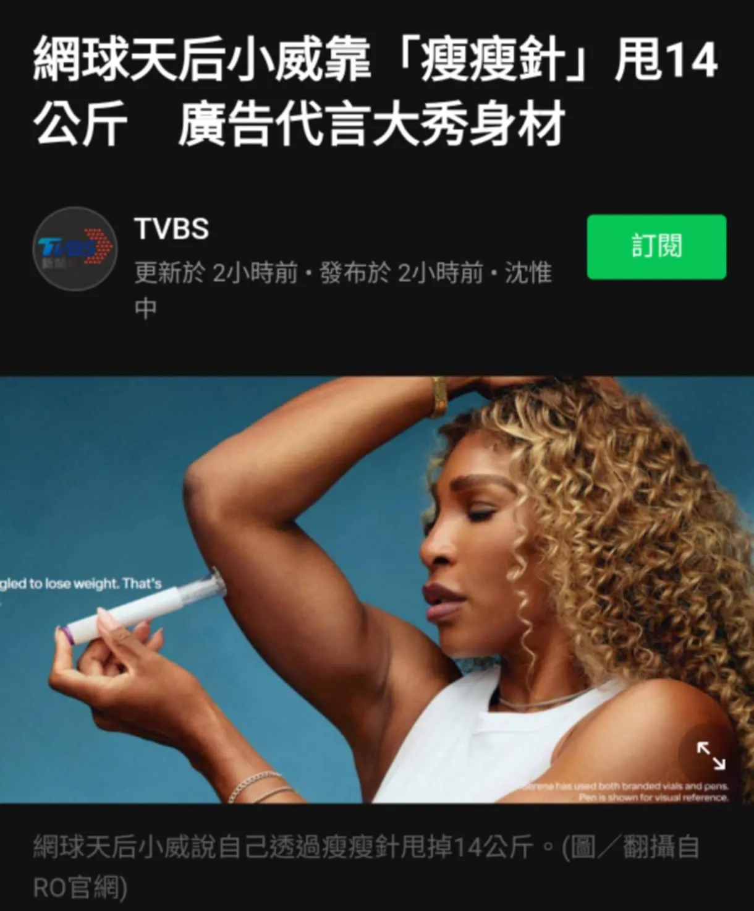

# Threads 貼文 DNsibiqZjSC

- 帳號: [@drchenghao](https://www.threads.com/@drchenghao)（程皓醫師｜好動人生。 運動與家庭醫學，已認證）
- 貼文 URL: https://www.threads.com/@drchenghao/post/DNsibiqZjSC
- 發文時間: 2025-08-23T19:30:15+08:00（UTC+8，時間戳 1755948615）
- 類型: photo
- 愛心數: 309
- 回覆數: 20
- 轉發數: 11
- 引用數: 0
- 備註: 貼文曾被編輯

## 貼文文字

瘦瘦針竟然連頂尖運動員都在使用！

女網傳奇 Serena Williams 前幾天揭露自己使用瘦瘦針，老實說我也非常驚訝，畢竟從小看到大。

且藝人、模特兒也就算了，但連一向以對抗傳統形象的超級女性運動員都接受，並代言此藥，其代表的意義完全不一樣。

她受訪時表示，自己接受高強度訓練，也很控制飲食，但生完孩子後，身體就是沒反應，「我才意識到，這根本不是意志力的問題。」她瘦了14公斤，疼痛也改善許多。

我同樣認同，科技就是為了輔助人類往健康邁進，而瘦瘦針，就是個好工具。

留言看更多文章🔥

## 圖片

- 原始圖片 URL: https://scontent-sin6-3.cdninstagram.com/v/t51.82787-15/535826352_17877653484446758_2186244493931996596_n.webp?efg=eyJ2ZW5jb2RlX3RhZyI6InRocmVhZHMuRkVFRC5pbWFnZV91cmxnZW4uMTIyMC5zZHIucmVndWxhcl9waG90by5jMiJ9&_nc_ht=scontent-sin6-3.cdninstagram.com&_nc_cat=110&_nc_oc=Q6cZ2gHz9dZ9sDlXfBfGmvnGn9IwoN9gXA6hOj-VYt9ZeeT6Xl0jxmNE-GbfT0aaxLAHsIPY3OJjli2qsl96QAAbE68i&_nc_ohc=EDYz3DqTjHwQ7kNvwEKkpxw&_nc_gid=2L2tKG7Xb6KP9-0GqX5nRQ&edm=APs17CUBAAAA&ccb=7-5&ig_cache_key=MzcwNTQ4ODAxOTY0NDg4ODE5NA%3D%3D.3-ccb7-5&oh=00_AQLWmsNkO8qSL05FXzPhGaHML-nbzPU58Bh6q3cp-1m9ow&oe=6AA602F9&_nc_sid=10d13b
- 尺寸: 1220x1473
