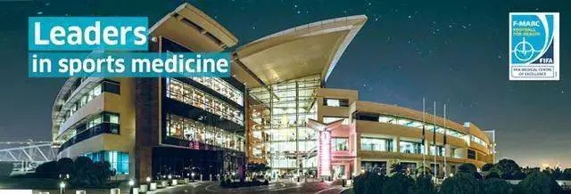

# Threads 貼文 DO-RPe5k9hX

- 帳號: [@drchenghao](https://www.threads.com/@drchenghao)（程皓醫師｜好動人生。 運動與家庭醫學，已認證）
- 貼文 URL: https://www.threads.com/@drchenghao/post/DO-RPe5k9hX
- 發文時間: 2025-09-24T13:17:47+08:00（UTC+8，時間戳 1758691067）
- 類型: photo
- 愛心數: 48
- 回覆數: 7
- 轉發數: 0
- 引用數: 0
- 備註: 貼文曾被編輯

## 貼文文字

10/6-12 將前往卡達參加 Aspetar 國際運動醫學研討會，到世界級運動醫學醫院參訪，Messi、Neymar 等選手都曾前往該醫院！
有機會也會轉播當地風土民情，敬請期待~

屆時會休診 10/6-10/11 和 10/13 早診，有需要看診的朋友可以這幾天先來看診唷，後面也記得不要白跑一趟，謝謝

## 圖片

- 原始圖片 URL: https://scontent-sin6-3.cdninstagram.com/v/t51.82787-15/554268043_17886057048446758_3536965704446357529_n.webp?efg=eyJ2ZW5jb2RlX3RhZyI6InRocmVhZHMuRkVFRC5pbWFnZV91cmxnZW4uNjQwLnNkci5yZWd1bGFyX3Bob3RvLmMyIn0&_nc_ht=scontent-sin6-3.cdninstagram.com&_nc_cat=110&_nc_oc=Q6cZ2gGU6D82VENLk1EdFP4QbL_3NWTDKZ2w0XzHnDyTOPHtEP8E2_pvCppfibH8LFJPQ63muaMLyH1p7jA4zos999fe&_nc_ohc=vY0oRbVbUnUQ7kNvwFAJCh_&_nc_gid=U7jkWGqI7U12DSL0BYJtYQ&edm=APs17CUBAAAA&ccb=7-5&ig_cache_key=MzcyODQ5MzM3MjI3MDQzNDM5MQ%3D%3D.3-ccb7-5&oh=00_AQLmaU9jPXbQnWGW7kQyQoYl2BT44Dts1ZI1M4mtfFyzKw&oe=6AA6038F&_nc_sid=10d13b
- 尺寸: 640x218
