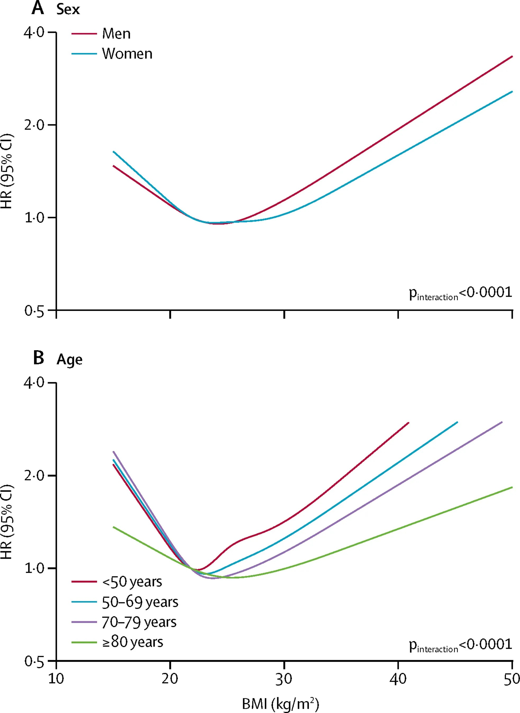

# Threads 貼文 DO02nCWk6UK

- 帳號: [@drchenghao](https://www.threads.com/@drchenghao)（程皓醫師｜好動人生。 運動與家庭醫學，已認證）
- 貼文 URL: https://www.threads.com/@drchenghao/post/DO02nCWk6UK
- 發文時間: 2025-09-20T21:31:55+08:00（UTC+8，時間戳 1758375115）
- 類型: photo
- 愛心數: 51
- 回覆數: 5
- 轉發數: 0
- 引用數: 0

## 貼文文字

［健康小知識］
BMI 與死亡率呈J型關係

BMI 21-25 風險最低
BMI 30 以上，平均餘命少約4年
BMI 18.5 以下，平均餘命少約4.4年

過重、過輕都該注意，
不要過度追求極端體重唷！
留言看文獻 🔥

## 圖片

- 原始圖片 URL: https://scontent-sin6-3.cdninstagram.com/v/t51.82787-15/551876745_17885083680446758_7028493034546551614_n.webp?efg=eyJ2ZW5jb2RlX3RhZyI6InRocmVhZHMuRkVFRC5pbWFnZV91cmxnZW4uMTk2Ni5zZHIucmVndWxhcl9waG90by5jMiJ9&_nc_ht=scontent-sin6-3.cdninstagram.com&_nc_cat=110&_nc_oc=Q6cZ2gFR6UfRJv2IxiU8gYudjWqDoAY4rR4UohuFqqiRnrQ98B8tTcq1jCTIeVM7vBH5N-m4m8Bdd8PK2VDmZURw3tgd&_nc_ohc=G_tVUKUTSbcQ7kNvwHO1pbC&_nc_gid=1HvdzT_LeoWrFjxMHCtxDA&edm=APs17CUBAAAA&ccb=7-5&ig_cache_key=MzcyNTg0Mjk2ODgzOTY5MzU3OA%3D%3D.3-ccb7-5&oh=00_AQKboSEx8mu4lb_YaPqjtqm8YJLJSzFSaXm_4C9pHPRiQA&oe=6AA5F88D&_nc_sid=10d13b
- 尺寸: 1966x2694
