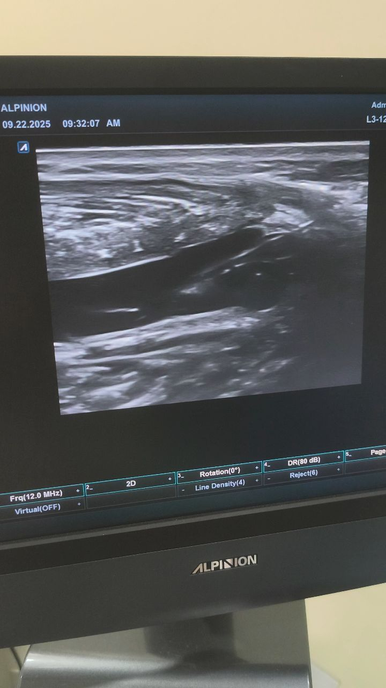

# Threads 貼文 DO5dvlFkx46

- 帳號: [@drchenghao](https://www.threads.com/@drchenghao)（程皓醫師｜好動人生。 運動與家庭醫學，已認證）
- 貼文 URL: https://www.threads.com/@drchenghao/post/DO5dvlFkx46
- 發文時間: 2025-09-22T16:31:41+08:00（UTC+8，時間戳 1758529901）
- 類型: video
- 愛心數: 19
- 回覆數: 6
- 轉發數: 0
- 引用數: 1
- 備註: 貼文曾被編輯

## 貼文文字

門診療癒時刻
超音波導引抽血水，猜猜這是什麼位置？
以及為什麼要抽比較好呢？
後面來解答🔥

## 影片封面圖

- 原始圖片 URL: https://scontent-sin11-1.cdninstagram.com/v/t51.82787-15/552407054_17885550408446758_1502192670055909187_n.jpg?stp=dst-jpg_e15_tt6&_nc_cat=105&ig_cache_key=MzcyNzE0MDk3OTYxMTk5OTgwMg%3D%3D.3-ccb7-5&ccb=7-5&_nc_sid=58cdad&efg=eyJ2ZW5jb2RlX3RhZyI6IkZFRUQueHBpZHMuNzIwLnNkci52aWRlb19kZWZhdWx0X2NvdmVyX2ZyYW1lLkMzIn0%3D&_nc_ohc=tOSHFQT-8pYQ7kNvwFSRlvC&_nc_oc=AdpFhV2AzoMkkSQfn0lQ-09RbhbiXLNCnEuZomd8Ogupnpme-_fz6ifvT6YwpkdaXVSIQg1tuHK6n7h-jeal7Z2D&_nc_ad=z-m&_nc_cid=0&_nc_zt=23&_nc_ht=scontent-sin11-1.cdninstagram.com&_nc_gid=U7jkWGqI7U12DSL0BYJtYQ&_nc_ss=7a22e&oh=00_AQIX5gBBRiXz3CgzjVOUXP_le_zmoQc64WrhzJzX_Z3VwQ&oe=6AA5DE27
- 尺寸: 720x1280
## 影片

- 影片 URL: https://scontent-sin2-3.cdninstagram.com/o1/v/t16/f2/m69/AQO7SAEEI5cuYMFhsmHsQiqkXy_1d_72q9t7fiWoV-lZz1y9wcyqHQ6QDNv8OtkWGmEGdm0EvArdbsRcarm9zKeB.mp4?strext=1&_nc_cat=107&_nc_sid=8bf8fe&_nc_ht=scontent-sin2-3.cdninstagram.com&_nc_ohc=keXFoan5DRYQ7kNvwGXrRR9&efg=eyJ2ZW5jb2RlX3RhZyI6Inhwdl9wcm9ncmVzc2l2ZS5JTlNUQUdSQU0uRkVFRC5DMy43MTgucHJvZ3Jlc3NpdmVfaDI2NC1iYXNpYy1nZW4yXzcyMHAiLCJ4cHZfYXNzZXRfaWQiOjEzMzM1MzE4MjgyODA3NzAsImFzc2V0X2FnZV9kYXlzIjozNTEsInZpX3VzZWNhc2VfaWQiOjEwMTY0LCJkdXJhdGlvbl9zIjozMiwidXJsZ2VuX3NvdXJjZSI6Ind3dyJ9&ccb=17-1&_nc_gid=U7jkWGqI7U12DSL0BYJtYQ&_nc_ss=7a22e&_nc_zt=28&oh=00_AQLWdsxXsIibthx0fum9hw-jZaNHhWbujKugQPyUTvCCxQ&oe=6AA5E3B1
- 影片寬高: NonexNone
