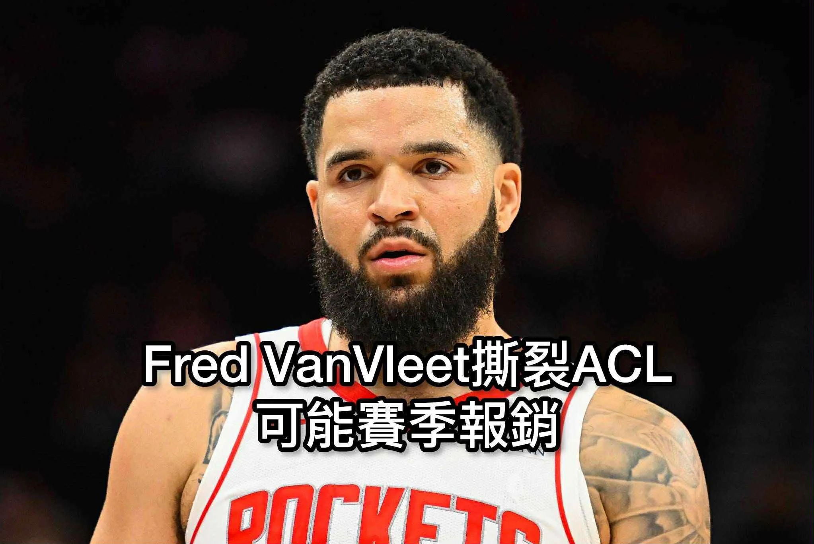

# Threads 貼文 DO7HgaNE10s

- 帳號: [@drchenghao](https://www.threads.com/@drchenghao)（程皓醫師｜好動人生。 運動與家庭醫學，已認證）
- 貼文 URL: https://www.threads.com/@drchenghao/post/DO7HgaNE10s
- 發文時間: 2025-09-23T07:55:00+08:00（UTC+8，時間戳 1758585300）
- 類型: photo
- 愛心數: 50
- 回覆數: 5
- 轉發數: 1
- 引用數: 0

## 貼文文字

火箭 Fred VanVleet 
由於隊內練習，
前十字韌帶撕裂，整季可能宣布報銷

ACL 撕裂傷，回場率在9成以上，通常至少需 9-12 個月恢復期

目前他31歲，未來依然有完美回歸機會，但在控衛短缺的火箭，實在影響很大，讓火箭競爭冠軍的道路上多了一個大變數，KD QQ

## 圖片

- 原始圖片 URL: https://scontent-sin6-3.cdninstagram.com/v/t51.82787-15/552574509_17885764371446758_8914643695577082111_n.webp?efg=eyJ2ZW5jb2RlX3RhZyI6InRocmVhZHMuRkVFRC5pbWFnZV91cmxnZW4uMjA0Ni5zZHIucmVndWxhcl9waG90by5jMiJ9&_nc_ht=scontent-sin6-3.cdninstagram.com&_nc_cat=110&_nc_oc=Q6cZ2gGU6D82VENLk1EdFP4QbL_3NWTDKZ2w0XzHnDyTOPHtEP8E2_pvCppfibH8LFJPQ63muaMLyH1p7jA4zos999fe&_nc_ohc=HLmPTclLFHQQ7kNvwGfFlBo&_nc_gid=U7jkWGqI7U12DSL0BYJtYQ&edm=APs17CUBAAAA&ccb=7-5&ig_cache_key=MzcyNzYwNjEzMDA2NDcxMDk1Ng%3D%3D.3-ccb7-5&oh=00_AQJ9gk0-t2tFFrMcWFsWwROyMEUavXVb1Xk0kB6aP2tvNA&oe=6AA5F40A&_nc_sid=10d13b
- 尺寸: 2046x1368
