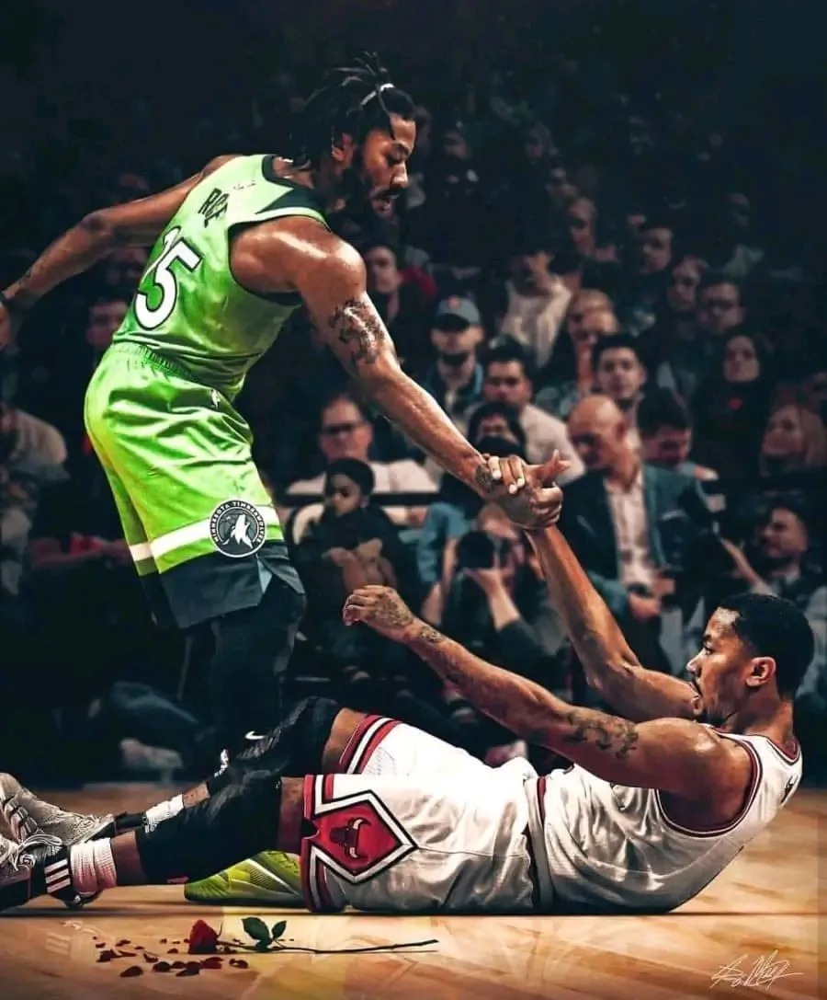

# Threads 貼文 DONoPfBE6wQ

- 帳號: [@drchenghao](https://www.threads.com/@drchenghao)（程皓醫師｜好動人生。 運動與家庭醫學，已認證）
- 貼文 URL: https://www.threads.com/@drchenghao/post/DONoPfBE6wQ
- 發文時間: 2025-09-05T15:55:59+08:00（UTC+8，時間戳 1757058959）
- 類型: photo
- 愛心數: 10
- 回覆數: 0
- 轉發數: 0
- 引用數: 0
- 備註: 此貼文為作者回覆自己的續文（self-thread），屬於同時發布的貼文群組 [DONn1LrE0KZ](https://www.threads.com/@drchenghao/post/DONn1LrE0KZ)

## 貼文文字

NBA 球員受傷後需要做多少訓練，
付出多少努力才能重回賽場，
你也需要，才有機會重回舞台

## 圖片

- 原始圖片 URL: https://scontent-sin6-3.cdninstagram.com/v/t51.82787-15/542236411_17880961890446758_7240145292091081133_n.webp?efg=eyJ2ZW5jb2RlX3RhZyI6InRocmVhZHMuRkVFRC5pbWFnZV91cmxnZW4uOTAwLnNkci5yZWd1bGFyX3Bob3RvLmMyIn0&_nc_ht=scontent-sin6-3.cdninstagram.com&_nc_cat=110&_nc_oc=Q6cZ2gG0H1C1o2xQ22pEuHfXQK_Sp9NNuf_M4Wc2I7g_uzP2xGRqHqJM4ojpcz3sKBSKluyQ4kM1WSPz0lJAF5mJXfT-&_nc_ohc=05Ts3jo8BSAQ7kNvwFvRoJf&_nc_gid=gi7Hjnc-ASnytD4DmFR6Ig&edm=APs17CUBAAAA&ccb=7-5&ig_cache_key=MzcxNDgwMjI1MzYwNzE4NTQyNA%3D%3D.3-ccb7-5&oh=00_AQIOiFIcuiBFjt3j_Gr4nKfwr3eJnHXBTkXrOZhPQEsntg&oe=6AA5EFE4&_nc_sid=10d13b
- 尺寸: 900x1087
