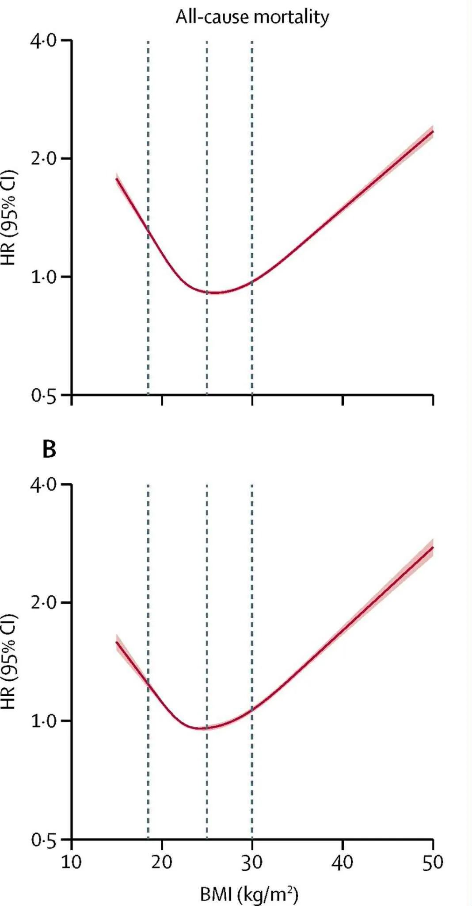

# Threads 貼文 DOvOSL8k3WP

- 帳號: [@drchenghao](https://www.threads.com/@drchenghao)（程皓醫師｜好動人生。 運動與家庭醫學，已認證）
- 貼文 URL: https://www.threads.com/@drchenghao/post/DOvOSL8k3WP
- 發文時間: 2025-09-18T17:03:20+08:00（UTC+8，時間戳 1758186200）
- 類型: photo
- 愛心數: 20
- 回覆數: 1
- 轉發數: 0
- 引用數: 0
- 備註: 此貼文為作者回覆自己的續文（self-thread），屬於同時發布的貼文群組 [DOvN_4YE79X](https://www.threads.com/@drchenghao/post/DOvN_4YE79X)

## 貼文文字

BMI 與死亡率呈J型曲線，
18.5以下，30以上都會顯著上升

## 圖片

- 原始圖片 URL: https://scontent-sin6-3.cdninstagram.com/v/t51.82787-15/551054499_17884419819446758_6535265124309875328_n.webp?efg=eyJ2ZW5jb2RlX3RhZyI6InRocmVhZHMuRkVFRC5pbWFnZV91cmxnZW4uMTA2OC5zZHIucmVndWxhcl9waG90by5jMiJ9&_nc_ht=scontent-sin6-3.cdninstagram.com&_nc_cat=110&_nc_oc=Q6cZ2gFR6UfRJv2IxiU8gYudjWqDoAY4rR4UohuFqqiRnrQ98B8tTcq1jCTIeVM7vBH5N-m4m8Bdd8PK2VDmZURw3tgd&_nc_ohc=QVh4_eTR5XEQ7kNvwGcDvML&_nc_gid=1HvdzT_LeoWrFjxMHCtxDA&edm=APs17CUBAAAA&ccb=7-5&ig_cache_key=MzcyNDI1ODIzOTI4Nzg4MzE1MQ%3D%3D.3-ccb7-5&oh=00_AQJsPwqpuUpM6uUanCZBmrUEt98oV6yagNa6JqrdfXz-PA&oe=6AA5E4CA&_nc_sid=10d13b
- 尺寸: 1068x2047
