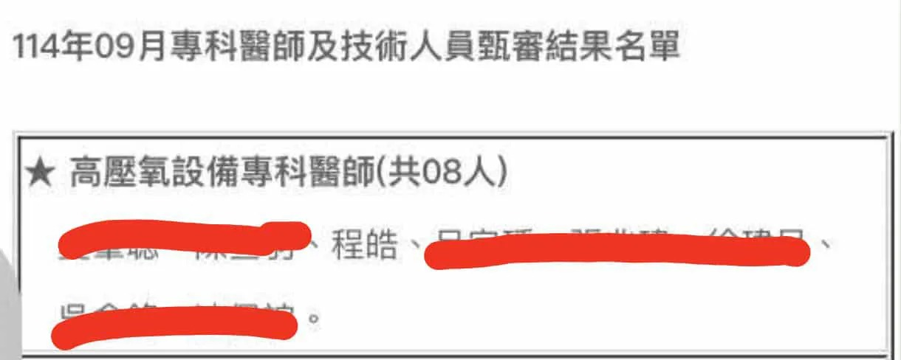

# Threads 貼文 DOx4kcYE4i1

- 帳號: [@drchenghao](https://www.threads.com/@drchenghao)（程皓醫師｜好動人生。 運動與家庭醫學，已認證）
- 貼文 URL: https://www.threads.com/@drchenghao/post/DOx4kcYE4i1
- 發文時間: 2025-09-19T17:51:19+08:00（UTC+8，時間戳 1758275479）
- 類型: photo
- 愛心數: 86
- 回覆數: 12
- 轉發數: 2
- 引用數: 0

## 貼文文字

高壓氧專科順利通過！✅
未來門診將增加高壓氧服務

其實高壓氧是職業運動員修復利器，
NBA球員以 LeBron James 為首大量使用

對於運動員部分，
增加血液組織含氧量，
比賽、訓練傷後修復，
組織消腫等都有臨床成效

未來持續分享高壓氧適應症唷
留言看更多文章！🔥

## 圖片

- 原始圖片 URL: https://scontent-sin6-3.cdninstagram.com/v/t51.82787-15/551118266_17884746219446758_8156169138508823909_n.webp?efg=eyJ2ZW5jb2RlX3RhZyI6InRocmVhZHMuRkVFRC5pbWFnZV91cmxnZW4uMTIyMC5zZHIucmVndWxhcl9waG90by5jMiJ9&_nc_ht=scontent-sin6-3.cdninstagram.com&_nc_cat=110&_nc_oc=Q6cZ2gFR6UfRJv2IxiU8gYudjWqDoAY4rR4UohuFqqiRnrQ98B8tTcq1jCTIeVM7vBH5N-m4m8Bdd8PK2VDmZURw3tgd&_nc_ohc=MxFRTkCDJLcQ7kNvwHUVwPK&_nc_gid=1HvdzT_LeoWrFjxMHCtxDA&edm=APs17CUBAAAA&ccb=7-5&ig_cache_key=MzcyNTAwNzE2MTc4NjU5OTYwNQ%3D%3D.3-ccb7-5&oh=00_AQLYPPR25y8TYZU0NjkicjVvIPGgu6zuyz0vrNM4464VKA&oe=6AA5D3D1&_nc_sid=10d13b
- 尺寸: 1220x488
