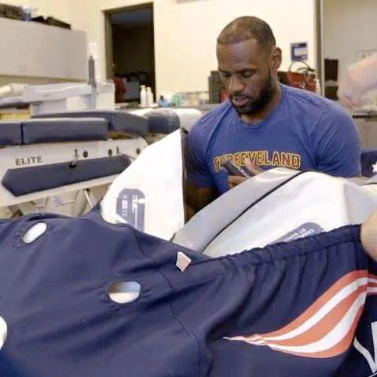

# Threads 貼文 DOx4sztE1PH

- 帳號: [@drchenghao](https://www.threads.com/@drchenghao)（程皓醫師｜好動人生。 運動與家庭醫學，已認證）
- 貼文 URL: https://www.threads.com/@drchenghao/post/DOx4sztE1PH
- 發文時間: 2025-09-19T17:52:27+08:00（UTC+8，時間戳 1758275547）
- 類型: photo
- 愛心數: 4
- 回覆數: 0
- 轉發數: 0
- 引用數: 0
- 備註: 此貼文為作者回覆自己的續文（self-thread），屬於同時發布的貼文群組 [DOx4kcYE4i1](https://www.threads.com/@drchenghao/post/DOx4kcYE4i1)

## 貼文文字

老詹有自己高壓氧艙，沒事就進去睡一下

## 圖片

- 原始圖片 URL: https://scontent-sin6-3.cdninstagram.com/v/t51.82787-15/551069178_17884746507446758_4604746419841296110_n.webp?efg=eyJ2ZW5jb2RlX3RhZyI6InRocmVhZHMuRkVFRC5pbWFnZV91cmxnZW4uNDgwLnNkci5yZWd1bGFyX3Bob3RvLmMyIn0&_nc_ht=scontent-sin6-3.cdninstagram.com&_nc_cat=110&_nc_oc=Q6cZ2gFR6UfRJv2IxiU8gYudjWqDoAY4rR4UohuFqqiRnrQ98B8tTcq1jCTIeVM7vBH5N-m4m8Bdd8PK2VDmZURw3tgd&_nc_ohc=vB1SNSSFvLEQ7kNvwHNk6p5&_nc_gid=1HvdzT_LeoWrFjxMHCtxDA&edm=APs17CUBAAAA&ccb=7-5&ig_cache_key=MzcyNTAwNzczNjU5MDc4MzQzMQ%3D%3D.3-ccb7-5&oh=00_AQJ9xkbLeEW6By9IymxYkt0shbC9xhovElhL9ZS2Y9uGxw&oe=6AA60021&_nc_sid=10d13b
- 尺寸: 480x480
