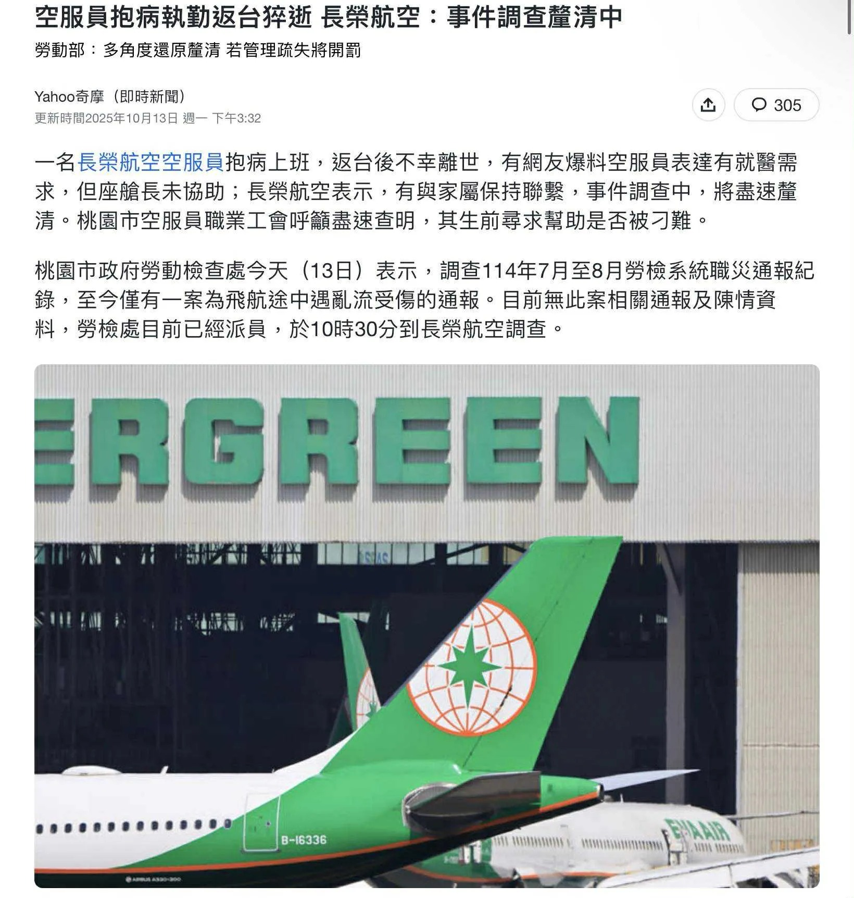

# Threads 貼文 DP0HRvOE-eP

- 帳號: [@drchenghao](https://www.threads.com/@drchenghao)（程皓醫師｜好動人生。 運動與家庭醫學，已認證）
- 貼文 URL: https://www.threads.com/@drchenghao/post/DP0HRvOE-eP
- 發文時間: 2025-10-15T11:09:42+08:00（UTC+8，時間戳 1760497782）
- 類型: photo
- 愛心數: 25
- 回覆數: 3
- 轉發數: 0
- 引用數: 0
- 備註: 貼文曾被編輯

## 貼文文字

長榮空服員的事件讓人難過

責任可能在座艙長、也可能是公司制度問題，但當你已反覆發燒、關節痠痛、無力等症狀時，此時只有你能保護脆弱的自己。

好好請假看病找出原因，其他事讓別人去煩惱，若公司百般刁難，那就是你該離開的時候了。

會珍惜、守護你自己健康的，永遠只有你的家人還有你自己。

## 圖片

- 原始圖片 URL: https://scontent-sin6-3.cdninstagram.com/v/t51.82787-15/566358467_17892344916446758_1823422241921443781_n.webp?efg=eyJ2ZW5jb2RlX3RhZyI6InRocmVhZHMuRkVFRC5pbWFnZV91cmxnZW4uMTY0MC5zZHIucmVndWxhcl9waG90by5jMiJ9&_nc_ht=scontent-sin6-3.cdninstagram.com&_nc_cat=110&_nc_oc=Q6cZ2gEnyXsOZ0bTh5ibOGUJCIzCq6ezzZbbnHUQJkYbjnt30HiWkiRQrVfBkChfz98QiXr4J2mbjZ5Juv1WTkAVAZF4&_nc_ohc=Q3NmoUvQbyQQ7kNvwEjHnpD&_nc_gid=M09jXC8babhmVMvbDXCzWA&edm=APs17CUBAAAA&ccb=7-5&ig_cache_key=Mzc0MzY0OTE5NTUxMDQ1ODI1NQ%3D%3D.3-ccb7-5&oh=00_AQJDAwIq-ubiP3my61JRXAdMwT57KIcM4bbfF4dl-0bmYw&oe=6AA5D630&_nc_sid=10d13b
- 尺寸: 1640x1723
